STEC outbreak model
================
Bdevleesschauwer
Tue Nov 06 13:06:10 2018

# Settings

``` r
## required packages
library(bd)
library(ggplot2)
library(knitr)


## simulations
n <- 1e4
set.seed(264)
```

# Data

``` r
## import data
dta <-
  readxl("All data FINAL_oCTOBER 2018_2.xlsx", "FINAL data WITHOUT Water")
str(dta)
```

    ## 'data.frame':    957 obs. of  51 variables:
    ##  $ id                 : chr  "1" "2" "3" "4" ...
    ##  $ Year               : chr  "2003" "2011" "2014" "1982" ...
    ##  $ Country            : chr  "Argentina" "Argentina" "Argentina" "Canada" ...
    ##  $ WHO_Region         : chr  "AMRO" "AMRO" "AMRO" "AMRO" ...
    ##  $ fboStrengthStrong  : chr  NA NA NA NA ...
    ##  $ Agent              : chr  "Verotoxigenic E. coli (VTEC)" "Verotoxigenic E. coli (VTEC)" "Verotoxigenic E. coli (VTEC)" "STEC" ...
    ##  $ Serotype           : chr  NA NA NA "O157:H7" ...
    ##  $ Virulence_factors  : chr  NA NA NA NA ...
    ##  $ fboCode            : chr  NA NA NA NA ...
    ##  $ fboOtherAgents     : chr  NA NA NA NA ...
    ##  $ Outb_Type          : chr  NA NA NA NA ...
    ##  $ Vehicle            : chr  "Homemade hamburger" "Ground beef" "Ground beef" "hamburger" ...
    ##  $ VehicleInfo        : chr  "Homemade hamburger" "Ground beef" "Ground beef" NA ...
    ##  $ Evidence           : chr  "Epidemiologic and laboratory confirmation" "Epidemiologic and laboratory confirmation" "Epidemiologic and laboratory confirmation" "Epidemiological" ...
    ##  $ Setting            : chr  NA NA NA "Old age home" ...
    ##  $ PlaceOrigin        : chr  NA NA NA NA ...
    ##  $ VehicleOrigin      : chr  NA NA NA NA ...
    ##  $ Risk_oFactor       : chr  NA NA NA NA ...
    ##  $ Num_Outbreaks      : num  NA NA NA NA NA NA NA NA NA NA ...
    ##  $ numHumanCases_str  : chr  NA NA NA "353" ...
    ##  $ Num_Cases          : num  1 1 1 353 2 79 109 13 6 16 ...
    ##  $ numHospitalised_str: chr  "1" "1" "1" "4" ...
    ##  $ Num_Hospitalised   : chr  "1" "1" "1" "4" ...
    ##  $ HUS                : chr  "1" "1" "1" NA ...
    ##  $ numDeaths_str      : chr  NA NA NA "1" ...
    ##  $ Num_Deaths         : chr  NA NA NA "1" ...
    ##  $ Comments           : chr  NA NA NA NA ...
    ##  $ footnote           : chr  NA NA NA NA ...
    ##  $ Source             : chr  "Homemade hamburger" "Ground beef" "Ground beef" NA ...
    ##  $ Food               : chr  "Hamburger(ground beef*)" "Ground beef" "Ground beef" "hamburger" ...
    ##  $ Total              : num  NA NA NA NA NA NA NA NA NA NA ...
    ##  $ Unknown_NA         : num  NA NA NA NA NA NA NA NA NA NA ...
    ##  $ Complex_Simple     : chr  "S" "S" "S" "S" ...
    ##  $ Eggs               : num  0 0 0 0 0 0 0 0 0 0 ...
    ##  $ Dairy              : num  0 0 0 0 1 0 0 1 0 1 ...
    ##  $ Meat               : num  0 0 0 0 0 0 0 0 0 0 ...
    ##  $ Poultry            : num  0 0 0 0 0 0 0 0 0 0 ...
    ##  $ Chicken            : num  0 0 0 0 0 0 0 0 0 0 ...
    ##  $ Ducks              : num  0 0 0 0 0 0 0 0 0 0 ...
    ##  $ Turkey             : num  0 0 0 0 0 0 0 0 0 0 ...
    ##  $ Beef               : num  1 1 1 1 0 0 0 0 0 0 ...
    ##  $ Pork               : num  0 0 0 0 0 1 0 0 1 0 ...
    ##  $ Lamb               : num  0 0 0 0 0 0 0 0 0 0 ...
    ##  $ Mutton             : num  0 0 0 0 0 0 0 0 0 0 ...
    ##  $ Game               : num  0 0 0 0 0 0 0 0 0 0 ...
    ##  $ Vegetables.fruit   : num  0 0 0 0 0 0 1 0 0 0 ...
    ##  $ GrainsBeans        : num  0 0 0 0 0 0 0 0 0 0 ...
    ##  $ Seafood            : num  0 0 0 0 0 0 0 0 0 0 ...
    ##  $ nuts               : num  0 0 0 0 0 0 0 0 0 0 ...
    ##  $ Oils_sugar         : num  0 0 0 0 0 0 0 0 0 0 ...
    ##  $ check              : num  1 1 1 1 1 1 1 1 1 1 ...

``` r
## change food names
names(dta)[names(dta) == "Vegetables.fruit"] <-
  "Vegetables and fruit"
names(dta)[names(dta) == "GrainsBeans"] <-
  "Grains and beans"
names(dta)[names(dta) == "Oils_sugar"] <-
  "Oils and sugar"
names(dta)[names(dta) == "nuts"] <-
  "Nuts"

## add indicator combining region-type
dta$Region_Type <- paste(dta$WHO_Region, dta$Complex_Simple)

## descriptions
table(dta$WHO_Region)
```

    ## 
    ## AMRO EURO WPRO 
    ##  746  176   35

``` r
table(dta$Complex_Simple)
```

    ## 
    ##   A   C   S 
    ## 539  57 361

``` r
table(dta$WHO_Region, dta$Complex_Simple)
```

    ##       
    ##          A   C   S
    ##   AMRO 406  45 295
    ##   EURO 109   8  59
    ##   WPRO  24   4   7

``` r
## number of implied foods per type
table(rowSums(dta[dta$Complex_Simple == "S", 34:50]))  # all =1 ?
```

    ## 
    ##   1 
    ## 361

``` r
table(rowSums(dta[dta$Complex_Simple == "C", 34:50]))  # all >1 ?
```

    ## 
    ##  2  3  4 
    ## 43 12  2

``` r
table(rowSums(dta[dta$Complex_Simple == "A", 34:50]))  # all =0 ?
```

    ## 
    ##   0 
    ## 539

# Model

``` r
outbreak_model <-
function(.n, .dta, .F, .S) {
  ## prior distribution / Dirichlet
  sourceS <- colSums(.S)
  PriorS <- mc2d::rdirichlet(.n, sourceS)
  colnames(PriorS) <- names(sourceS)

  PriorS_out <- t(apply(PriorS, 2, mean_ci))[rev(order(colMeans(PriorS))), ]
  print(kable(PriorS_out, digits = 3))

  PriorS_df <- as.data.frame(PriorS_out)
  colnames(PriorS_df) <- c("mean", "lwr", "upr")
  PriorS_df$Food <- 
    factor(rownames(PriorS_df),
           rownames(PriorS_df)[rev(order(PriorS_df$mean))])

  print(
    ggplot(PriorS_df, aes(x = Food, y = mean)) +
      geom_pointrange(aes(ymin = lwr, ymax = upr), size = 0.1) +
      theme_bw() +
      theme(axis.text.x = element_text(angle = 45, hjust = 1)) +
      scale_y_continuous(expression(P[j])) +
      scale_x_discrete(NULL))

  ## simple foods
  sourceSAMRO <- colSums(.F[.dta$Region_Type == "AMRO S", ])
  sourceSEURO <- colSums(.F[.dta$Region_Type == "EURO S", ])
  sourceSWPRO <- colSums(.F[.dta$Region_Type == "WPRO S", ])

  print(
    kable(
      cbind(sourceSAMRO,
            sourceSEURO,
            sourceSWPRO)[rev(order(sourceSAMRO)), ]))

  ## redistribute complex foods
  aAMRO <- array(dim = c(ncol(.F), sum(.dta$Region_Type == "AMRO C"), .n))
  aEURO <- array(dim = c(ncol(.F), sum(.dta$Region_Type == "EURO C"), .n))
  aWPRO <- array(dim = c(ncol(.F), sum(.dta$Region_Type == "WPRO C"), .n))

  for (i in seq(ncol(.F))) {  # fill array per source
    aAMRO[i, ,] <- .F[.dta$Region_Type == "AMRO C", i] %o% PriorS[, i]
    aEURO[i, ,] <- .F[.dta$Region_Type == "EURO C", i] %o% PriorS[, i]
    aWPRO[i, ,] <- .F[.dta$Region_Type == "WPRO C", i] %o% PriorS[, i]
  }


  ## per iteration, simulate single food source
  simulate <-
  function(x) {
    if (dim(x)[2] == 0) {
      y <- 0
    } else {
      y <- apply(x, 3, function(z) apply(z, 2, rmultinom, n = 1, size = 1))
      y <- array(y, dim = dim(x))
    }
  }

  nm <- 20  # number of multinomial samples

  cAMRO <- replicate(nm, simulate(aAMRO)); str(cAMRO)
  cEURO <- replicate(nm, simulate(aEURO)); str(cEURO)
  cWPRO <- replicate(nm, simulate(aWPRO)); str(cWPRO)

  cAMRO <- array(cAMRO, dim = dim(aAMRO) * c(1, 1, nm))
  cEURO <- array(cEURO, dim = dim(aEURO) * c(1, 1, nm))
  cWPRO <- array(cWPRO, dim = dim(aWPRO) * c(1, 1, nm))

  ## sum of complex food outbreaks per source
  sourceCAMRO <- apply(cAMRO, c(1,3), sum); str(sourceCAMRO)
  sourceCEURO <- apply(cEURO, c(1,3), sum); str(sourceCEURO)
  sourceCWPRO <- apply(cWPRO, c(1,3), sum); str(sourceCWPRO)

  rownames(sourceCAMRO) <-
    rownames(sourceCEURO) <-
    rownames(sourceCWPRO) <-
    colnames(PriorS)

  sourceCAMRO_out <- t(apply(sourceCAMRO, 1, mean_ci))
  sourceCEURO_out <- t(apply(sourceCEURO, 1, mean_ci))
  sourceCWPRO_out <- t(apply(sourceCWPRO, 1, mean_ci))

  print(
    kable(
      sourceCAMRO_out[rev(order(sourceCAMRO_out[, 1])), ], digits = 1))
  print(
    kable(
      sourceCEURO_out[rev(order(sourceCEURO_out[, 1])), ], digits = 1))
  print(
    kable(
      sourceCWPRO_out[rev(order(sourceCWPRO_out[, 1])), ], digits = 1))

  ## total outbreaks
  TotalAMRO <- sourceSAMRO + sourceCAMRO
  TotalEURO <- sourceSEURO + sourceCEURO
  TotalWPRO <- sourceSWPRO + sourceCWPRO

  TotalAMRO_out <- t(apply(TotalAMRO, 1, mean_ci))
  TotalEURO_out <- t(apply(TotalEURO, 1, mean_ci))
  TotalWPRO_out <- t(apply(TotalWPRO, 1, mean_ci))

  print(kable(TotalAMRO_out[rev(order(TotalAMRO_out[, 1])), ], digits = 1))
  print(kable(TotalEURO_out[rev(order(TotalEURO_out[, 1])), ], digits = 1))
  print(kable(TotalWPRO_out[rev(order(TotalWPRO_out[, 1])), ], digits = 1))

  ## total outbreak attributions
  AttribAMRO <- 100 * TotalAMRO / sum(.dta$WHO_Region == "AMRO")
  AttribEURO <- 100 * TotalEURO / sum(.dta$WHO_Region == "EURO")
  AttribWPRO <- 100 * TotalWPRO / sum(.dta$WHO_Region == "WPRO")

  AttribAMRO_out <- t(apply(AttribAMRO, 1, mean_ci))
  AttribEURO_out <- t(apply(AttribEURO, 1, mean_ci))
  AttribWPRO_out <- t(apply(AttribWPRO, 1, mean_ci))

  ## add unknown
  AttribAMRO_unk <- rbind(AttribAMRO, Unknown = 100 - colSums(AttribAMRO))
  AttribEURO_unk <- rbind(AttribEURO, Unknown = 100 - colSums(AttribEURO))
  AttribWPRO_unk <- rbind(AttribWPRO, Unknown = 100 - colSums(AttribWPRO))

  AttribAMRO_unk_out <- t(apply(AttribAMRO_unk, 1, mean_ci))
  AttribEURO_unk_out <- t(apply(AttribEURO_unk, 1, mean_ci))
  AttribWPRO_unk_out <- t(apply(AttribWPRO_unk, 1, mean_ci))

  print(
    kable(
      AttribAMRO_unk_out[rev(order(AttribAMRO_unk_out[, 1])), ], digits = 1))
  print(
    kable(
      AttribEURO_unk_out[rev(order(AttribEURO_unk_out[, 1])), ], digits = 1))
  print(
    kable(
      AttribWPRO_unk_out[rev(order(AttribWPRO_unk_out[, 1])), ], digits = 1))

  ## normalized
  AttribAMRO_norm <- 100 * apply(AttribAMRO/100, 2, prop.table)
  AttribEURO_norm <- 100 * apply(AttribEURO/100, 2, prop.table)
  AttribWPRO_norm <- 100 * apply(AttribWPRO/100, 2, prop.table)

  AttribAMRO_norm_out <- t(apply(AttribAMRO_norm, 1, mean_ci))
  AttribEURO_norm_out <- t(apply(AttribEURO_norm, 1, mean_ci))
  AttribWPRO_norm_out <- t(apply(AttribWPRO_norm, 1, mean_ci))

  print(
    kable(
      AttribAMRO_norm_out[rev(order(AttribAMRO_norm_out[, 1])), ],
      digits = 1))
  print(
    kable(
      AttribEURO_norm_out[rev(order(AttribEURO_norm_out[, 1])), ],
      digits = 1))
  print(
    kable(
      AttribWPRO_norm_out[rev(order(AttribWPRO_norm_out[, 1])), ],
      digits = 1))

  ## plot all results / with unknown
  df <-
  rbind(
    data.frame(Region = "AMRO",
               Food = rownames(AttribAMRO_out),
               AttribAMRO_out),
    data.frame(Region = "EURO",
               Food = rownames(AttribEURO_out),
               AttribEURO_out),
    data.frame(Region = "WPRO",
               Food = rownames(AttribWPRO_out),
               AttribWPRO_out))

  foods <- rev(rownames(AttribAMRO_out[order(AttribAMRO_out[, 1]), ]))
  df$Food <- factor(df$Food, levels = foods)
  df$Region <- gsub("O", "", df$Region)

  print(
  ggplot(df, aes(x = Food, y = mean)) +
    geom_col(fill = "grey90") +
    geom_pointrange(aes(ymin = X2.5., ymax = X97.5.), size = 0.1) +
    facet_grid(~Region) +
    theme_bw() +
    theme(axis.text.x = element_text(angle = 45, hjust = 1)) +
    scale_y_continuous("Attributable proportion") +
    scale_x_discrete(NULL))

  ## plot all results / normalized
  df2 <-
  rbind(
    data.frame(Region = "AMRO",
               Food = rownames(AttribAMRO_out),
               AttribAMRO_norm_out),
    data.frame(Region = "EURO",
               Food = rownames(AttribEURO_out),
               AttribEURO_norm_out),
    data.frame(Region = "WPRO",
               Food = rownames(AttribWPRO_out),
               AttribWPRO_norm_out))

  foods <- rev(rownames(AttribAMRO_out[order(AttribAMRO_out[, 1]), ]))
  df2$Food <- factor(df2$Food, levels = foods)
  df2$Region <- gsub("O", "", df2$Region)

  print(
    ggplot(df2, aes(x = Food, y = mean)) +
      geom_col(fill = "grey90") +
      geom_pointrange(aes(ymin = X2.5., ymax = X97.5.), size = 0.1) +
      facet_grid(~Region) +
      theme_bw() +
      theme(axis.text.x = element_text(angle = 45, hjust = 1)) +
      scale_y_continuous("Attributable proportion") +
      scale_x_discrete(NULL))

  ## summary table - with unknown
  print(
    kable(
      digits = 1,
      cbind(AttribAMRO_unk_out, AttribEURO_unk_out, AttribWPRO_unk_out)))

  ## summary table - normalized
  print(
    kable(
      digits = 1,
      cbind(AttribAMRO_norm_out, AttribEURO_norm_out, AttribWPRO_norm_out)))

}
```

# HUS

``` r
table(dta$HUS, useNA = "always")
```

    ## 
    ##                                  0                                  1 
    ##                                320                                121 
    ##                                 10                                  2 
    ##                                  2                                 59 
    ##                                 26                                  3 
    ##                                  1                                 25 
    ##                                 31                                  4 
    ##                                  1                                 11 
    ##                                  5                                  6 
    ##                                  8                                  2 
    ##                                  7                                  8 
    ##                                  3                                  1 
    ##                                800      Bloody stools(3); Diarrhea(3) 
    ##                                  1                                  1 
    ## HUS (Hemolytic Uremic Syndrome)(0) HUS (Hemolytic Uremic Syndrome)(3) 
    ##                                  1                                  1 
    ##                               <NA> 
    ##                                399

``` r
dta$HUS[is.na(dta$HUS)] <- 0
is_hus <-
  dta$HUS != "0" &
  dta$HUS != "Bloody stools(3); Diarrhea(3)" &
  dta$HUS != "HUS (Hemolytic Uremic Syndrome)(0)"
table(is_hus)
```

    ## is_hus
    ## FALSE  TRUE 
    ##   721   236

``` r
###
### WITH HUS
###

## subset data
dta_hus <- dta[is_hus, ]
str(dta_hus)
```

    ## 'data.frame':    236 obs. of  52 variables:
    ##  $ id                  : chr  "1" "2" "3" "13" ...
    ##  $ Year                : chr  "2003" "2011" "2014" "2013" ...
    ##  $ Country             : chr  "Argentina" "Argentina" "Argentina" "Canada" ...
    ##  $ WHO_Region          : chr  "AMRO" "AMRO" "AMRO" "AMRO" ...
    ##  $ fboStrengthStrong   : chr  NA NA NA NA ...
    ##  $ Agent               : chr  "Verotoxigenic E. coli (VTEC)" "Verotoxigenic E. coli (VTEC)" "Verotoxigenic E. coli (VTEC)" "STEC" ...
    ##  $ Serotype            : chr  NA NA NA "O157:H7" ...
    ##  $ Virulence_factors   : chr  NA NA NA NA ...
    ##  $ fboCode             : chr  NA NA NA NA ...
    ##  $ fboOtherAgents      : chr  NA NA NA NA ...
    ##  $ Outb_Type           : chr  NA NA NA NA ...
    ##  $ Vehicle             : chr  "Homemade hamburger" "Ground beef" "Ground beef" "Beef and veal tatare" ...
    ##  $ VehicleInfo         : chr  "Homemade hamburger" "Ground beef" "Ground beef" NA ...
    ##  $ Evidence            : chr  "Epidemiologic and laboratory confirmation" "Epidemiologic and laboratory confirmation" "Epidemiologic and laboratory confirmation" "Epidemiological" ...
    ##  $ Setting             : chr  NA NA NA "resturant" ...
    ##  $ PlaceOrigin         : chr  NA NA NA NA ...
    ##  $ VehicleOrigin       : chr  NA NA NA NA ...
    ##  $ Risk_oFactor        : chr  NA NA NA NA ...
    ##  $ Num_Outbreaks       : num  NA NA NA NA NA NA NA NA NA NA ...
    ##  $ numHumanCases_str   : chr  NA NA NA "7" ...
    ##  $ Num_Cases           : num  1 1 1 7 119 14 12 30 28 8 ...
    ##  $ numHospitalised_str : chr  "1" "1" "1" "2 (1 HUS)" ...
    ##  $ Num_Hospitalised    : chr  "1" "1" "1" "2 (1 HUS)" ...
    ##  $ HUS                 : chr  "1" "1" "1" "1" ...
    ##  $ numDeaths_str       : chr  NA NA NA "0" ...
    ##  $ Num_Deaths          : chr  NA NA NA "0" ...
    ##  $ Comments            : chr  NA NA NA NA ...
    ##  $ footnote            : chr  NA NA NA NA ...
    ##  $ Source              : chr  "Homemade hamburger" "Ground beef" "Ground beef" NA ...
    ##  $ Food                : chr  "Hamburger(ground beef*)" "Ground beef" "Ground beef" "Beef and veal tatare" ...
    ##  $ Total               : num  NA NA NA NA NA NA NA NA NA NA ...
    ##  $ Unknown_NA          : num  NA NA NA NA NA NA NA NA NA NA ...
    ##  $ Complex_Simple      : chr  "S" "S" "S" "S" ...
    ##  $ Eggs                : num  0 0 0 0 0 0 0 0 0 0 ...
    ##  $ Dairy               : num  0 0 0 0 0 0 0 0 1 0 ...
    ##  $ Meat                : num  0 0 0 0 0 0 0 0 0 0 ...
    ##  $ Poultry             : num  0 0 0 0 0 0 0 0 0 0 ...
    ##  $ Chicken             : num  0 0 0 0 0 0 0 0 0 0 ...
    ##  $ Ducks               : num  0 0 0 0 0 0 0 0 0 0 ...
    ##  $ Turkey              : num  0 0 0 0 0 0 0 0 0 0 ...
    ##  $ Beef                : num  1 1 1 1 0 0 1 0 0 0 ...
    ##  $ Pork                : num  0 0 0 0 1 0 0 0 0 0 ...
    ##  $ Lamb                : num  0 0 0 0 0 0 0 0 0 0 ...
    ##  $ Mutton              : num  0 0 0 0 0 0 0 0 0 0 ...
    ##  $ Game                : num  0 0 0 0 0 0 0 0 0 0 ...
    ##  $ Vegetables and fruit: num  0 0 0 0 0 0 0 1 0 1 ...
    ##  $ Grains and beans    : num  0 0 0 0 0 0 0 0 0 0 ...
    ##  $ Seafood             : num  0 0 0 0 0 0 0 0 0 0 ...
    ##  $ Nuts                : num  0 0 0 0 0 1 0 0 0 0 ...
    ##  $ Oils and sugar      : num  0 0 0 0 0 0 0 0 0 0 ...
    ##  $ check               : num  1 1 1 1 1 1 1 1 1 1 ...
    ##  $ Region_Type         : chr  "AMRO S" "AMRO S" "AMRO S" "AMRO S" ...

``` r
## extract ALL outbreak data
F_hus <- dta_hus[, 34:50]; str(F_hus)
```

    ## 'data.frame':    236 obs. of  17 variables:
    ##  $ Eggs                : num  0 0 0 0 0 0 0 0 0 0 ...
    ##  $ Dairy               : num  0 0 0 0 0 0 0 0 1 0 ...
    ##  $ Meat                : num  0 0 0 0 0 0 0 0 0 0 ...
    ##  $ Poultry             : num  0 0 0 0 0 0 0 0 0 0 ...
    ##  $ Chicken             : num  0 0 0 0 0 0 0 0 0 0 ...
    ##  $ Ducks               : num  0 0 0 0 0 0 0 0 0 0 ...
    ##  $ Turkey              : num  0 0 0 0 0 0 0 0 0 0 ...
    ##  $ Beef                : num  1 1 1 1 0 0 1 0 0 0 ...
    ##  $ Pork                : num  0 0 0 0 1 0 0 0 0 0 ...
    ##  $ Lamb                : num  0 0 0 0 0 0 0 0 0 0 ...
    ##  $ Mutton              : num  0 0 0 0 0 0 0 0 0 0 ...
    ##  $ Game                : num  0 0 0 0 0 0 0 0 0 0 ...
    ##  $ Vegetables and fruit: num  0 0 0 0 0 0 0 1 0 1 ...
    ##  $ Grains and beans    : num  0 0 0 0 0 0 0 0 0 0 ...
    ##  $ Seafood             : num  0 0 0 0 0 0 0 0 0 0 ...
    ##  $ Nuts                : num  0 0 0 0 0 1 0 0 0 0 ...
    ##  $ Oils and sugar      : num  0 0 0 0 0 0 0 0 0 0 ...

``` r
sort(colSums(F_hus), decreasing = TRUE)
```

    ## Vegetables and fruit                 Beef                Dairy 
    ##                   43                   42                   19 
    ##                 Meat                 Eggs     Grains and beans 
    ##                    6                    5                    5 
    ##              Chicken       Oils and sugar                 Pork 
    ##                    3                    2                    1 
    ##                 Lamb                 Game              Seafood 
    ##                    1                    1                    1 
    ##                 Nuts              Poultry                Ducks 
    ##                    1                    0                    0 
    ##               Turkey               Mutton 
    ##                    0                    0

``` r
table(rowSums(F_hus))
```

    ## 
    ##   0   1   2   3 
    ## 125  96  11   4

``` r
## extract SIMPLE outbreak data
S_hus <- dta_hus[dta_hus$Complex_Simple == "S", 34:50]; str(S_hus)
```

    ## 'data.frame':    96 obs. of  17 variables:
    ##  $ Eggs                : num  0 0 0 0 0 0 0 0 0 0 ...
    ##  $ Dairy               : num  0 0 0 0 0 0 0 0 1 0 ...
    ##  $ Meat                : num  0 0 0 0 0 0 0 0 0 0 ...
    ##  $ Poultry             : num  0 0 0 0 0 0 0 0 0 0 ...
    ##  $ Chicken             : num  0 0 0 0 0 0 0 0 0 0 ...
    ##  $ Ducks               : num  0 0 0 0 0 0 0 0 0 0 ...
    ##  $ Turkey              : num  0 0 0 0 0 0 0 0 0 0 ...
    ##  $ Beef                : num  1 1 1 1 0 0 1 0 0 0 ...
    ##  $ Pork                : num  0 0 0 0 1 0 0 0 0 0 ...
    ##  $ Lamb                : num  0 0 0 0 0 0 0 0 0 0 ...
    ##  $ Mutton              : num  0 0 0 0 0 0 0 0 0 0 ...
    ##  $ Game                : num  0 0 0 0 0 0 0 0 0 0 ...
    ##  $ Vegetables and fruit: num  0 0 0 0 0 0 0 1 0 1 ...
    ##  $ Grains and beans    : num  0 0 0 0 0 0 0 0 0 0 ...
    ##  $ Seafood             : num  0 0 0 0 0 0 0 0 0 0 ...
    ##  $ Nuts                : num  0 0 0 0 0 1 0 0 0 0 ...
    ##  $ Oils and sugar      : num  0 0 0 0 0 0 0 0 0 0 ...

``` r
sort(colSums(S_hus), decreasing = TRUE)
```

    ##                 Beef Vegetables and fruit                Dairy 
    ##                   37                   34                   13 
    ##                 Meat     Grains and beans                 Pork 
    ##                    5                    2                    1 
    ##                 Lamb                 Game              Seafood 
    ##                    1                    1                    1 
    ##                 Nuts                 Eggs              Poultry 
    ##                    1                    0                    0 
    ##              Chicken                Ducks               Turkey 
    ##                    0                    0                    0 
    ##               Mutton       Oils and sugar 
    ##                    0                    0

``` r
table(rowSums(S_hus))  # all == 1 ?
```

    ## 
    ##  1 
    ## 96

``` r
## apply outbreak model
outbreak_model(n, dta_hus, F_hus, S_hus)
```

    ## 
    ## 
    ##                          mean    2.5%   97.5%
    ## ---------------------  ------  ------  ------
    ## Beef                    0.386   0.292   0.485
    ## Vegetables and fruit    0.354   0.262   0.453
    ## Dairy                   0.136   0.075   0.211
    ## Meat                    0.052   0.018   0.104
    ## Grains and beans        0.021   0.002   0.057
    ## Seafood                 0.011   0.000   0.039
    ## Lamb                    0.010   0.000   0.038
    ## Game                    0.010   0.000   0.038
    ## Nuts                    0.010   0.000   0.038
    ## Pork                    0.010   0.000   0.038
    ## Oils and sugar          0.000   0.000   0.000
    ## Mutton                  0.000   0.000   0.000
    ## Turkey                  0.000   0.000   0.000
    ## Ducks                   0.000   0.000   0.000
    ## Chicken                 0.000   0.000   0.000
    ## Poultry                 0.000   0.000   0.000
    ## Eggs                    0.000   0.000   0.000

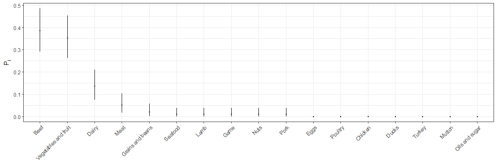<!-- -->

    ## 
    ## 
    ##                         sourceSAMRO   sourceSEURO   sourceSWPRO
    ## ---------------------  ------------  ------------  ------------
    ## Beef                             37             0             0
    ## Vegetables and fruit             30             1             3
    ## Dairy                            13             0             0
    ## Meat                              5             0             0
    ## Grains and beans                  2             0             0
    ## Nuts                              1             0             0
    ## Seafood                           1             0             0
    ## Game                              1             0             0
    ## Lamb                              1             0             0
    ## Pork                              1             0             0
    ## Oils and sugar                    0             0             0
    ## Mutton                            0             0             0
    ## Turkey                            0             0             0
    ## Ducks                             0             0             0
    ## Chicken                           0             0             0
    ## Poultry                           0             0             0
    ## Eggs                              0             0             0
    ##  int [1:17, 1:15, 1:10000, 1:20] 0 0 0 0 0 0 0 1 0 0 ...
    ##  num [1:20] 0 0 0 0 0 0 0 0 0 0 ...
    ##  num [1:20] 0 0 0 0 0 0 0 0 0 0 ...
    ##  int [1:17, 1:200000] 0 4 0 0 0 0 0 5 0 0 ...
    ##  num [1:17, 1:200000] 0 0 0 0 0 0 0 0 0 0 ...
    ##  num [1:17, 1:200000] 0 0 0 0 0 0 0 0 0 0 ...
    ## 
    ## 
    ##                         mean   2.5%   97.5%
    ## ---------------------  -----  -----  ------
    ## Vegetables and fruit     7.2      5       9
    ## Dairy                    4.4      4       6
    ## Beef                     3.1      1       5
    ## Grains and beans         0.2      0       1
    ## Meat                     0.1      0       1
    ## Oils and sugar           0.0      0       0
    ## Nuts                     0.0      0       0
    ## Seafood                  0.0      0       0
    ## Game                     0.0      0       0
    ## Mutton                   0.0      0       0
    ## Lamb                     0.0      0       0
    ## Pork                     0.0      0       0
    ## Turkey                   0.0      0       0
    ## Ducks                    0.0      0       0
    ## Chicken                  0.0      0       0
    ## Poultry                  0.0      0       0
    ## Eggs                     0.0      0       0
    ## 
    ## 
    ##                         mean   2.5%   97.5%
    ## ---------------------  -----  -----  ------
    ## Oils and sugar             0      0       0
    ## Nuts                       0      0       0
    ## Seafood                    0      0       0
    ## Grains and beans           0      0       0
    ## Vegetables and fruit       0      0       0
    ## Game                       0      0       0
    ## Mutton                     0      0       0
    ## Lamb                       0      0       0
    ## Pork                       0      0       0
    ## Beef                       0      0       0
    ## Turkey                     0      0       0
    ## Ducks                      0      0       0
    ## Chicken                    0      0       0
    ## Poultry                    0      0       0
    ## Meat                       0      0       0
    ## Dairy                      0      0       0
    ## Eggs                       0      0       0
    ## 
    ## 
    ##                         mean   2.5%   97.5%
    ## ---------------------  -----  -----  ------
    ## Oils and sugar             0      0       0
    ## Nuts                       0      0       0
    ## Seafood                    0      0       0
    ## Grains and beans           0      0       0
    ## Vegetables and fruit       0      0       0
    ## Game                       0      0       0
    ## Mutton                     0      0       0
    ## Lamb                       0      0       0
    ## Pork                       0      0       0
    ## Beef                       0      0       0
    ## Turkey                     0      0       0
    ## Ducks                      0      0       0
    ## Chicken                    0      0       0
    ## Poultry                    0      0       0
    ## Meat                       0      0       0
    ## Dairy                      0      0       0
    ## Eggs                       0      0       0
    ## 
    ## 
    ##                         mean   2.5%   97.5%
    ## ---------------------  -----  -----  ------
    ## Beef                    40.1     38      42
    ## Vegetables and fruit    37.2     35      39
    ## Dairy                   17.4     17      19
    ## Meat                     5.1      5       6
    ## Grains and beans         2.2      2       3
    ## Nuts                     1.0      1       1
    ## Seafood                  1.0      1       1
    ## Game                     1.0      1       1
    ## Lamb                     1.0      1       1
    ## Pork                     1.0      1       1
    ## Oils and sugar           0.0      0       0
    ## Mutton                   0.0      0       0
    ## Turkey                   0.0      0       0
    ## Ducks                    0.0      0       0
    ## Chicken                  0.0      0       0
    ## Poultry                  0.0      0       0
    ## Eggs                     0.0      0       0
    ## 
    ## 
    ##                         mean   2.5%   97.5%
    ## ---------------------  -----  -----  ------
    ## Vegetables and fruit       1      1       1
    ## Oils and sugar             0      0       0
    ## Nuts                       0      0       0
    ## Seafood                    0      0       0
    ## Grains and beans           0      0       0
    ## Game                       0      0       0
    ## Mutton                     0      0       0
    ## Lamb                       0      0       0
    ## Pork                       0      0       0
    ## Beef                       0      0       0
    ## Turkey                     0      0       0
    ## Ducks                      0      0       0
    ## Chicken                    0      0       0
    ## Poultry                    0      0       0
    ## Meat                       0      0       0
    ## Dairy                      0      0       0
    ## Eggs                       0      0       0
    ## 
    ## 
    ##                         mean   2.5%   97.5%
    ## ---------------------  -----  -----  ------
    ## Vegetables and fruit       3      3       3
    ## Oils and sugar             0      0       0
    ## Nuts                       0      0       0
    ## Seafood                    0      0       0
    ## Grains and beans           0      0       0
    ## Game                       0      0       0
    ## Mutton                     0      0       0
    ## Lamb                       0      0       0
    ## Pork                       0      0       0
    ## Beef                       0      0       0
    ## Turkey                     0      0       0
    ## Ducks                      0      0       0
    ## Chicken                    0      0       0
    ## Poultry                    0      0       0
    ## Meat                       0      0       0
    ## Dairy                      0      0       0
    ## Eggs                       0      0       0
    ## 
    ## 
    ##                         mean   2.5%   97.5%
    ## ---------------------  -----  -----  ------
    ## Unknown                 53.1   53.1    53.1
    ## Beef                    17.6   16.7    18.4
    ## Vegetables and fruit    16.3   15.4    17.1
    ## Dairy                    7.6    7.5     8.3
    ## Meat                     2.2    2.2     2.6
    ## Grains and beans         0.9    0.9     1.3
    ## Nuts                     0.4    0.4     0.4
    ## Seafood                  0.4    0.4     0.4
    ## Game                     0.4    0.4     0.4
    ## Lamb                     0.4    0.4     0.4
    ## Pork                     0.4    0.4     0.4
    ## Oils and sugar           0.0    0.0     0.0
    ## Mutton                   0.0    0.0     0.0
    ## Turkey                   0.0    0.0     0.0
    ## Ducks                    0.0    0.0     0.0
    ## Chicken                  0.0    0.0     0.0
    ## Poultry                  0.0    0.0     0.0
    ## Eggs                     0.0    0.0     0.0
    ## 
    ## 
    ##                         mean   2.5%   97.5%
    ## ---------------------  -----  -----  ------
    ## Vegetables and fruit     100    100     100
    ## Unknown                    0      0       0
    ## Oils and sugar             0      0       0
    ## Nuts                       0      0       0
    ## Seafood                    0      0       0
    ## Grains and beans           0      0       0
    ## Game                       0      0       0
    ## Mutton                     0      0       0
    ## Lamb                       0      0       0
    ## Pork                       0      0       0
    ## Beef                       0      0       0
    ## Turkey                     0      0       0
    ## Ducks                      0      0       0
    ## Chicken                    0      0       0
    ## Poultry                    0      0       0
    ## Meat                       0      0       0
    ## Dairy                      0      0       0
    ## Eggs                       0      0       0
    ## 
    ## 
    ##                         mean   2.5%   97.5%
    ## ---------------------  -----  -----  ------
    ## Unknown                 57.1   57.1    57.1
    ## Vegetables and fruit    42.9   42.9    42.9
    ## Oils and sugar           0.0    0.0     0.0
    ## Nuts                     0.0    0.0     0.0
    ## Seafood                  0.0    0.0     0.0
    ## Grains and beans         0.0    0.0     0.0
    ## Game                     0.0    0.0     0.0
    ## Mutton                   0.0    0.0     0.0
    ## Lamb                     0.0    0.0     0.0
    ## Pork                     0.0    0.0     0.0
    ## Beef                     0.0    0.0     0.0
    ## Turkey                   0.0    0.0     0.0
    ## Ducks                    0.0    0.0     0.0
    ## Chicken                  0.0    0.0     0.0
    ## Poultry                  0.0    0.0     0.0
    ## Meat                     0.0    0.0     0.0
    ## Dairy                    0.0    0.0     0.0
    ## Eggs                     0.0    0.0     0.0
    ## 
    ## 
    ##                         mean   2.5%   97.5%
    ## ---------------------  -----  -----  ------
    ## Beef                    37.5   35.5    39.3
    ## Vegetables and fruit    34.8   32.7    36.4
    ## Dairy                   16.3   15.9    17.8
    ## Meat                     4.8    4.7     5.6
    ## Grains and beans         2.0    1.9     2.8
    ## Nuts                     0.9    0.9     0.9
    ## Seafood                  0.9    0.9     0.9
    ## Game                     0.9    0.9     0.9
    ## Lamb                     0.9    0.9     0.9
    ## Pork                     0.9    0.9     0.9
    ## Oils and sugar           0.0    0.0     0.0
    ## Mutton                   0.0    0.0     0.0
    ## Turkey                   0.0    0.0     0.0
    ## Ducks                    0.0    0.0     0.0
    ## Chicken                  0.0    0.0     0.0
    ## Poultry                  0.0    0.0     0.0
    ## Eggs                     0.0    0.0     0.0
    ## 
    ## 
    ##                         mean   2.5%   97.5%
    ## ---------------------  -----  -----  ------
    ## Vegetables and fruit     100    100     100
    ## Oils and sugar             0      0       0
    ## Nuts                       0      0       0
    ## Seafood                    0      0       0
    ## Grains and beans           0      0       0
    ## Game                       0      0       0
    ## Mutton                     0      0       0
    ## Lamb                       0      0       0
    ## Pork                       0      0       0
    ## Beef                       0      0       0
    ## Turkey                     0      0       0
    ## Ducks                      0      0       0
    ## Chicken                    0      0       0
    ## Poultry                    0      0       0
    ## Meat                       0      0       0
    ## Dairy                      0      0       0
    ## Eggs                       0      0       0
    ## 
    ## 
    ##                         mean   2.5%   97.5%
    ## ---------------------  -----  -----  ------
    ## Vegetables and fruit     100    100     100
    ## Oils and sugar             0      0       0
    ## Nuts                       0      0       0
    ## Seafood                    0      0       0
    ## Grains and beans           0      0       0
    ## Game                       0      0       0
    ## Mutton                     0      0       0
    ## Lamb                       0      0       0
    ## Pork                       0      0       0
    ## Beef                       0      0       0
    ## Turkey                     0      0       0
    ## Ducks                      0      0       0
    ## Chicken                    0      0       0
    ## Poultry                    0      0       0
    ## Meat                       0      0       0
    ## Dairy                      0      0       0
    ## Eggs                       0      0       0

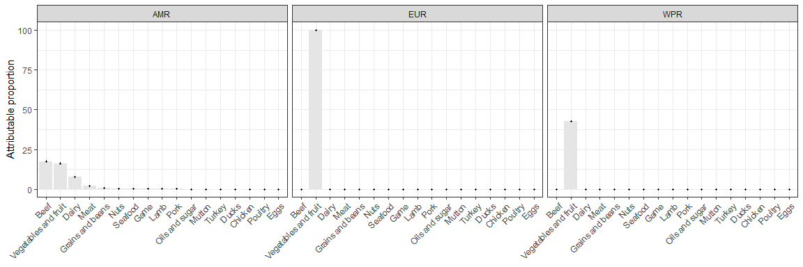<!-- -->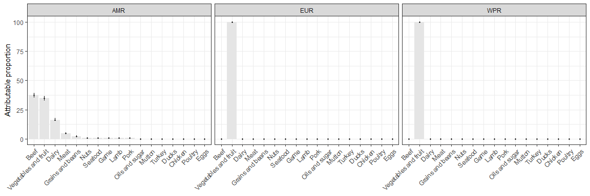<!-- -->

    ## 
    ## 
    ##                         mean   2.5%   97.5%   mean   2.5%   97.5%   mean   2.5%   97.5%
    ## ---------------------  -----  -----  ------  -----  -----  ------  -----  -----  ------
    ## Eggs                     0.0    0.0     0.0      0      0       0    0.0    0.0     0.0
    ## Dairy                    7.6    7.5     8.3      0      0       0    0.0    0.0     0.0
    ## Meat                     2.2    2.2     2.6      0      0       0    0.0    0.0     0.0
    ## Poultry                  0.0    0.0     0.0      0      0       0    0.0    0.0     0.0
    ## Chicken                  0.0    0.0     0.0      0      0       0    0.0    0.0     0.0
    ## Ducks                    0.0    0.0     0.0      0      0       0    0.0    0.0     0.0
    ## Turkey                   0.0    0.0     0.0      0      0       0    0.0    0.0     0.0
    ## Beef                    17.6   16.7    18.4      0      0       0    0.0    0.0     0.0
    ## Pork                     0.4    0.4     0.4      0      0       0    0.0    0.0     0.0
    ## Lamb                     0.4    0.4     0.4      0      0       0    0.0    0.0     0.0
    ## Mutton                   0.0    0.0     0.0      0      0       0    0.0    0.0     0.0
    ## Game                     0.4    0.4     0.4      0      0       0    0.0    0.0     0.0
    ## Vegetables and fruit    16.3   15.4    17.1    100    100     100   42.9   42.9    42.9
    ## Grains and beans         0.9    0.9     1.3      0      0       0    0.0    0.0     0.0
    ## Seafood                  0.4    0.4     0.4      0      0       0    0.0    0.0     0.0
    ## Nuts                     0.4    0.4     0.4      0      0       0    0.0    0.0     0.0
    ## Oils and sugar           0.0    0.0     0.0      0      0       0    0.0    0.0     0.0
    ## Unknown                 53.1   53.1    53.1      0      0       0   57.1   57.1    57.1
    ## 
    ## 
    ##                         mean   2.5%   97.5%   mean   2.5%   97.5%   mean   2.5%   97.5%
    ## ---------------------  -----  -----  ------  -----  -----  ------  -----  -----  ------
    ## Eggs                     0.0    0.0     0.0      0      0       0      0      0       0
    ## Dairy                   16.3   15.9    17.8      0      0       0      0      0       0
    ## Meat                     4.8    4.7     5.6      0      0       0      0      0       0
    ## Poultry                  0.0    0.0     0.0      0      0       0      0      0       0
    ## Chicken                  0.0    0.0     0.0      0      0       0      0      0       0
    ## Ducks                    0.0    0.0     0.0      0      0       0      0      0       0
    ## Turkey                   0.0    0.0     0.0      0      0       0      0      0       0
    ## Beef                    37.5   35.5    39.3      0      0       0      0      0       0
    ## Pork                     0.9    0.9     0.9      0      0       0      0      0       0
    ## Lamb                     0.9    0.9     0.9      0      0       0      0      0       0
    ## Mutton                   0.0    0.0     0.0      0      0       0      0      0       0
    ## Game                     0.9    0.9     0.9      0      0       0      0      0       0
    ## Vegetables and fruit    34.8   32.7    36.4    100    100     100    100    100     100
    ## Grains and beans         2.0    1.9     2.8      0      0       0      0      0       0
    ## Seafood                  0.9    0.9     0.9      0      0       0      0      0       0
    ## Nuts                     0.9    0.9     0.9      0      0       0      0      0       0
    ## Oils and sugar           0.0    0.0     0.0      0      0       0      0      0       0

``` r
###
### WITHOUT HUS
###

## subset data
dta_nohus <- dta[!is_hus, ]
str(dta_nohus)
```

    ## 'data.frame':    721 obs. of  52 variables:
    ##  $ id                  : chr  "4" "5" "6" "7" ...
    ##  $ Year                : chr  "1982" "1994" "2001" "2002" ...
    ##  $ Country             : chr  "Canada" "Canada" "Canada" "Canada" ...
    ##  $ WHO_Region          : chr  "AMRO" "AMRO" "AMRO" "AMRO" ...
    ##  $ fboStrengthStrong   : chr  NA NA NA NA ...
    ##  $ Agent               : chr  "STEC" "STEC" "STEC" "STEC" ...
    ##  $ Serotype            : chr  "O157:H7" "O157:H7" "O157:H7" "O157:H7" ...
    ##  $ Virulence_factors   : chr  NA NA NA NA ...
    ##  $ fboCode             : chr  NA NA NA NA ...
    ##  $ fboOtherAgents      : chr  NA NA NA NA ...
    ##  $ Outb_Type           : chr  NA NA NA NA ...
    ##  $ Vehicle             : chr  "hamburger" "Raw milk cheese" "pork ribs" "vegetables prepared on site / cook had diarrhea preceding outbreak" ...
    ##  $ VehicleInfo         : chr  NA NA NA NA ...
    ##  $ Evidence            : chr  "Epidemiological" "NA" "NA" "Epidemiological" ...
    ##  $ Setting             : chr  "Old age home" "home" "NA" "Hospital" ...
    ##  $ PlaceOrigin         : chr  NA NA NA NA ...
    ##  $ VehicleOrigin       : chr  NA NA NA NA ...
    ##  $ Risk_oFactor        : chr  NA NA NA NA ...
    ##  $ Num_Outbreaks       : num  NA NA NA NA NA NA NA NA NA NA ...
    ##  $ numHumanCases_str   : chr  "353" "2" "79" "109" ...
    ##  $ Num_Cases           : num  353 2 79 109 13 6 16 29 5 29 ...
    ##  $ numHospitalised_str : chr  "4" "NA" "NA" "NA" ...
    ##  $ Num_Hospitalised    : chr  "4" "NA" "NA" "NA" ...
    ##  $ HUS                 : chr  "0" "0" "0" "0" ...
    ##  $ numDeaths_str       : chr  "1" "0" "NA" "2" ...
    ##  $ Num_Deaths          : chr  "1" "0" "NA" "2" ...
    ##  $ Comments            : chr  NA NA NA NA ...
    ##  $ footnote            : chr  NA NA NA NA ...
    ##  $ Source              : chr  NA NA NA NA ...
    ##  $ Food                : chr  "hamburger" "Raw milk cheese" "pork ribs" "vegetables prepared on site / cook had diarrhea preceding outbreak" ...
    ##  $ Total               : num  NA NA NA NA NA NA NA NA NA NA ...
    ##  $ Unknown_NA          : num  NA NA NA NA NA NA NA NA NA NA ...
    ##  $ Complex_Simple      : chr  "S" "S" "S" "S" ...
    ##  $ Eggs                : num  0 0 0 0 0 0 0 0 0 0 ...
    ##  $ Dairy               : num  0 1 0 0 1 0 1 0 0 1 ...
    ##  $ Meat                : num  0 0 0 0 0 0 0 0 0 0 ...
    ##  $ Poultry             : num  0 0 0 0 0 0 0 0 0 0 ...
    ##  $ Chicken             : num  0 0 0 0 0 0 0 0 0 0 ...
    ##  $ Ducks               : num  0 0 0 0 0 0 0 0 0 0 ...
    ##  $ Turkey              : num  0 0 0 0 0 0 0 0 0 0 ...
    ##  $ Beef                : num  1 0 0 0 0 0 0 0 1 0 ...
    ##  $ Pork                : num  0 0 1 0 0 1 0 1 0 0 ...
    ##  $ Lamb                : num  0 0 0 0 0 0 0 0 0 0 ...
    ##  $ Mutton              : num  0 0 0 0 0 0 0 0 0 0 ...
    ##  $ Game                : num  0 0 0 0 0 0 0 0 0 0 ...
    ##  $ Vegetables and fruit: num  0 0 0 1 0 0 0 0 0 0 ...
    ##  $ Grains and beans    : num  0 0 0 0 0 0 0 0 0 0 ...
    ##  $ Seafood             : num  0 0 0 0 0 0 0 0 0 0 ...
    ##  $ Nuts                : num  0 0 0 0 0 0 0 0 0 0 ...
    ##  $ Oils and sugar      : num  0 0 0 0 0 0 0 0 0 0 ...
    ##  $ check               : num  1 1 1 1 1 1 1 1 1 1 ...
    ##  $ Region_Type         : chr  "AMRO S" "AMRO S" "AMRO S" "AMRO S" ...

``` r
## extract ALL outbreak data
F_nohus <- dta_nohus[, 34:50]; str(F_nohus)
```

    ## 'data.frame':    721 obs. of  17 variables:
    ##  $ Eggs                : num  0 0 0 0 0 0 0 0 0 0 ...
    ##  $ Dairy               : num  0 1 0 0 1 0 1 0 0 1 ...
    ##  $ Meat                : num  0 0 0 0 0 0 0 0 0 0 ...
    ##  $ Poultry             : num  0 0 0 0 0 0 0 0 0 0 ...
    ##  $ Chicken             : num  0 0 0 0 0 0 0 0 0 0 ...
    ##  $ Ducks               : num  0 0 0 0 0 0 0 0 0 0 ...
    ##  $ Turkey              : num  0 0 0 0 0 0 0 0 0 0 ...
    ##  $ Beef                : num  1 0 0 0 0 0 0 0 1 0 ...
    ##  $ Pork                : num  0 0 1 0 0 1 0 1 0 0 ...
    ##  $ Lamb                : num  0 0 0 0 0 0 0 0 0 0 ...
    ##  $ Mutton              : num  0 0 0 0 0 0 0 0 0 0 ...
    ##  $ Game                : num  0 0 0 0 0 0 0 0 0 0 ...
    ##  $ Vegetables and fruit: num  0 0 0 1 0 0 0 0 0 0 ...
    ##  $ Grains and beans    : num  0 0 0 0 0 0 0 0 0 0 ...
    ##  $ Seafood             : num  0 0 0 0 0 0 0 0 0 0 ...
    ##  $ Nuts                : num  0 0 0 0 0 0 0 0 0 0 ...
    ##  $ Oils and sugar      : num  0 0 0 0 0 0 0 0 0 0 ...

``` r
sort(colSums(F_nohus), decreasing = TRUE)
```

    ##                 Beef Vegetables and fruit                Dairy 
    ##                  122                  111                   42 
    ##     Grains and beans                 Pork                 Meat 
    ##                   23                   16                   13 
    ##              Chicken                 Lamb                 Game 
    ##                    8                    6                    6 
    ##                 Eggs              Seafood               Turkey 
    ##                    5                    5                    2 
    ##                 Nuts              Poultry                Ducks 
    ##                    2                    0                    0 
    ##               Mutton       Oils and sugar 
    ##                    0                    0

``` r
table(rowSums(F_nohus))
```

    ## 
    ##   0   1   2   3   4 
    ## 414 265  32   8   2

``` r
## extract SIMPLE outbreak data
S_nohus <- dta_nohus[dta_nohus$Complex_Simple == "S", 34:50]; str(S_nohus)
```

    ## 'data.frame':    265 obs. of  17 variables:
    ##  $ Eggs                : num  0 0 0 0 0 0 0 0 0 0 ...
    ##  $ Dairy               : num  0 1 0 0 1 0 1 0 0 1 ...
    ##  $ Meat                : num  0 0 0 0 0 0 0 0 0 0 ...
    ##  $ Poultry             : num  0 0 0 0 0 0 0 0 0 0 ...
    ##  $ Chicken             : num  0 0 0 0 0 0 0 0 0 0 ...
    ##  $ Ducks               : num  0 0 0 0 0 0 0 0 0 0 ...
    ##  $ Turkey              : num  0 0 0 0 0 0 0 0 0 0 ...
    ##  $ Beef                : num  1 0 0 0 0 0 0 0 1 0 ...
    ##  $ Pork                : num  0 0 1 0 0 1 0 1 0 0 ...
    ##  $ Lamb                : num  0 0 0 0 0 0 0 0 0 0 ...
    ##  $ Mutton              : num  0 0 0 0 0 0 0 0 0 0 ...
    ##  $ Game                : num  0 0 0 0 0 0 0 0 0 0 ...
    ##  $ Vegetables and fruit: num  0 0 0 1 0 0 0 0 0 0 ...
    ##  $ Grains and beans    : num  0 0 0 0 0 0 0 0 0 0 ...
    ##  $ Seafood             : num  0 0 0 0 0 0 0 0 0 0 ...
    ##  $ Nuts                : num  0 0 0 0 0 0 0 0 0 0 ...
    ##  $ Oils and sugar      : num  0 0 0 0 0 0 0 0 0 0 ...

``` r
sort(colSums(S_nohus), decreasing = TRUE)
```

    ##                 Beef Vegetables and fruit                Dairy 
    ##                  106                   82                   36 
    ##                 Pork     Grains and beans                 Meat 
    ##                   10                    8                    6 
    ##                 Game              Seafood                 Lamb 
    ##                    5                    5                    3 
    ##                 Nuts                 Eggs              Chicken 
    ##                    2                    1                    1 
    ##              Poultry                Ducks               Turkey 
    ##                    0                    0                    0 
    ##               Mutton       Oils and sugar 
    ##                    0                    0

``` r
table(rowSums(S_nohus))  # all == 1 ?
```

    ## 
    ##   1 
    ## 265

``` r
## apply outbreak model
outbreak_model(n, dta_nohus, F_nohus, S_nohus)
```

    ## 
    ## 
    ##                          mean    2.5%   97.5%
    ## ---------------------  ------  ------  ------
    ## Beef                    0.400   0.342   0.460
    ## Vegetables and fruit    0.309   0.254   0.365
    ## Dairy                   0.136   0.097   0.180
    ## Pork                    0.038   0.018   0.064
    ## Grains and beans        0.030   0.013   0.054
    ## Meat                    0.023   0.008   0.044
    ## Game                    0.019   0.006   0.038
    ## Seafood                 0.019   0.006   0.038
    ## Lamb                    0.011   0.002   0.027
    ## Nuts                    0.008   0.001   0.021
    ## Eggs                    0.004   0.000   0.014
    ## Chicken                 0.004   0.000   0.014
    ## Oils and sugar          0.000   0.000   0.000
    ## Mutton                  0.000   0.000   0.000
    ## Turkey                  0.000   0.000   0.000
    ## Ducks                   0.000   0.000   0.000
    ## Poultry                 0.000   0.000   0.000

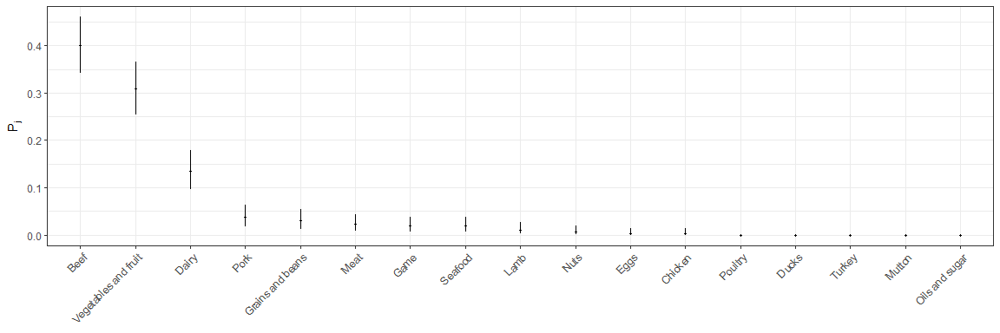<!-- -->

    ## 
    ## 
    ##                         sourceSAMRO   sourceSEURO   sourceSWPRO
    ## ---------------------  ------------  ------------  ------------
    ## Beef                             88            18             0
    ## Vegetables and fruit             67            15             0
    ## Dairy                            22            11             3
    ## Pork                              7             3             0
    ## Grains and beans                  6             2             0
    ## Game                              3             1             1
    ## Meat                              3             3             0
    ## Nuts                              2             0             0
    ## Seafood                           2             3             0
    ## Lamb                              2             1             0
    ## Chicken                           1             0             0
    ## Oils and sugar                    0             0             0
    ## Mutton                            0             0             0
    ## Turkey                            0             0             0
    ## Ducks                             0             0             0
    ## Poultry                           0             0             0
    ## Eggs                              0             1             0
    ##  int [1:17, 1:30, 1:10000, 1:20] 0 0 0 0 0 0 0 0 0 0 ...
    ##  int [1:17, 1:8, 1:10000, 1:20] 0 0 1 0 0 0 0 0 0 0 ...
    ##  int [1:17, 1:4, 1:10000, 1:20] 0 0 0 0 0 0 0 0 0 0 ...
    ##  int [1:17, 1:200000] 0 2 0 0 0 0 0 8 2 0 ...
    ##  int [1:17, 1:200000] 0 0 1 0 0 0 0 4 0 0 ...
    ##  int [1:17, 1:200000] 0 0 1 0 0 0 0 1 0 0 ...
    ## 
    ## 
    ##                         mean   2.5%   97.5%
    ## ---------------------  -----  -----  ------
    ## Vegetables and fruit    15.8     12      19
    ## Beef                     8.1      6      10
    ## Grains and beans         2.4      0       5
    ## Dairy                    1.8      0       4
    ## Pork                     1.3      0       3
    ## Lamb                     0.3      0       1
    ## Meat                     0.2      0       1
    ## Chicken                  0.0      0       1
    ## Game                     0.0      0       1
    ## Eggs                     0.0      0       1
    ## Oils and sugar           0.0      0       0
    ## Nuts                     0.0      0       0
    ## Seafood                  0.0      0       0
    ## Mutton                   0.0      0       0
    ## Turkey                   0.0      0       0
    ## Ducks                    0.0      0       0
    ## Poultry                  0.0      0       0
    ## 
    ## 
    ##                         mean   2.5%   97.5%
    ## ---------------------  -----  -----  ------
    ## Vegetables and fruit     4.1      2       6
    ## Beef                     2.8      1       5
    ## Meat                     0.9      0       2
    ## Chicken                  0.1      0       1
    ## Grains and beans         0.0      0       1
    ## Lamb                     0.0      0       1
    ## Oils and sugar           0.0      0       0
    ## Nuts                     0.0      0       0
    ## Seafood                  0.0      0       0
    ## Game                     0.0      0       0
    ## Mutton                   0.0      0       0
    ## Pork                     0.0      0       0
    ## Turkey                   0.0      0       0
    ## Ducks                    0.0      0       0
    ## Poultry                  0.0      0       0
    ## Dairy                    0.0      0       0
    ## Eggs                     0.0      0       0
    ## 
    ## 
    ##                         mean   2.5%   97.5%
    ## ---------------------  -----  -----  ------
    ## Vegetables and fruit     1.8      1       2
    ## Beef                     0.9      0       1
    ## Pork                     0.7      0       2
    ## Meat                     0.4      0       2
    ## Grains and beans         0.2      0       1
    ## Oils and sugar           0.0      0       0
    ## Nuts                     0.0      0       0
    ## Seafood                  0.0      0       0
    ## Game                     0.0      0       0
    ## Mutton                   0.0      0       0
    ## Lamb                     0.0      0       0
    ## Turkey                   0.0      0       0
    ## Ducks                    0.0      0       0
    ## Chicken                  0.0      0       0
    ## Poultry                  0.0      0       0
    ## Dairy                    0.0      0       0
    ## Eggs                     0.0      0       0
    ## 
    ## 
    ##                         mean   2.5%   97.5%
    ## ---------------------  -----  -----  ------
    ## Beef                    96.1     94      98
    ## Vegetables and fruit    82.8     79      86
    ## Dairy                   23.8     22      26
    ## Grains and beans         8.4      6      11
    ## Pork                     8.3      7      10
    ## Meat                     3.2      3       4
    ## Game                     3.0      3       4
    ## Lamb                     2.3      2       3
    ## Nuts                     2.0      2       2
    ## Seafood                  2.0      2       2
    ## Chicken                  1.0      1       2
    ## Eggs                     0.0      0       1
    ## Oils and sugar           0.0      0       0
    ## Mutton                   0.0      0       0
    ## Turkey                   0.0      0       0
    ## Ducks                    0.0      0       0
    ## Poultry                  0.0      0       0
    ## 
    ## 
    ##                         mean   2.5%   97.5%
    ## ---------------------  -----  -----  ------
    ## Beef                    20.8     19      23
    ## Vegetables and fruit    19.1     17      21
    ## Dairy                   11.0     11      11
    ## Meat                     3.9      3       5
    ## Seafood                  3.0      3       3
    ## Pork                     3.0      3       3
    ## Grains and beans         2.0      2       3
    ## Lamb                     1.0      1       2
    ## Game                     1.0      1       1
    ## Eggs                     1.0      1       1
    ## Chicken                  0.1      0       1
    ## Oils and sugar           0.0      0       0
    ## Nuts                     0.0      0       0
    ## Mutton                   0.0      0       0
    ## Turkey                   0.0      0       0
    ## Ducks                    0.0      0       0
    ## Poultry                  0.0      0       0
    ## 
    ## 
    ##                         mean   2.5%   97.5%
    ## ---------------------  -----  -----  ------
    ## Dairy                    3.0      3       3
    ## Vegetables and fruit     1.8      1       2
    ## Game                     1.0      1       1
    ## Beef                     0.9      0       1
    ## Pork                     0.7      0       2
    ## Meat                     0.4      0       2
    ## Grains and beans         0.2      0       1
    ## Oils and sugar           0.0      0       0
    ## Nuts                     0.0      0       0
    ## Seafood                  0.0      0       0
    ## Mutton                   0.0      0       0
    ## Lamb                     0.0      0       0
    ## Turkey                   0.0      0       0
    ## Ducks                    0.0      0       0
    ## Chicken                  0.0      0       0
    ## Poultry                  0.0      0       0
    ## Eggs                     0.0      0       0
    ## 
    ## 
    ##                         mean   2.5%   97.5%
    ## ---------------------  -----  -----  ------
    ## Unknown                 55.0   55.0    55.0
    ## Beef                    18.6   18.1    18.9
    ## Vegetables and fruit    16.0   15.3    16.6
    ## Dairy                    4.6    4.2     5.0
    ## Grains and beans         1.6    1.2     2.1
    ## Pork                     1.6    1.4     1.9
    ## Meat                     0.6    0.6     0.8
    ## Game                     0.6    0.6     0.8
    ## Lamb                     0.4    0.4     0.6
    ## Nuts                     0.4    0.4     0.4
    ## Seafood                  0.4    0.4     0.4
    ## Chicken                  0.2    0.2     0.4
    ## Eggs                     0.0    0.0     0.2
    ## Oils and sugar           0.0    0.0     0.0
    ## Mutton                   0.0    0.0     0.0
    ## Turkey                   0.0    0.0     0.0
    ## Ducks                    0.0    0.0     0.0
    ## Poultry                  0.0    0.0     0.0
    ## 
    ## 
    ##                         mean   2.5%   97.5%
    ## ---------------------  -----  -----  ------
    ## Unknown                 62.3   62.3    62.3
    ## Beef                    11.9   10.9    13.1
    ## Vegetables and fruit    10.9    9.7    12.0
    ## Dairy                    6.3    6.3     6.3
    ## Meat                     2.2    1.7     2.9
    ## Seafood                  1.7    1.7     1.7
    ## Pork                     1.7    1.7     1.7
    ## Grains and beans         1.2    1.1     1.7
    ## Lamb                     0.6    0.6     1.1
    ## Game                     0.6    0.6     0.6
    ## Eggs                     0.6    0.6     0.6
    ## Chicken                  0.1    0.0     0.6
    ## Oils and sugar           0.0    0.0     0.0
    ## Nuts                     0.0    0.0     0.0
    ## Mutton                   0.0    0.0     0.0
    ## Turkey                   0.0    0.0     0.0
    ## Ducks                    0.0    0.0     0.0
    ## Poultry                  0.0    0.0     0.0
    ## 
    ## 
    ##                         mean   2.5%   97.5%
    ## ---------------------  -----  -----  ------
    ## Unknown                 71.4   71.4    71.4
    ## Dairy                   10.7   10.7    10.7
    ## Vegetables and fruit     6.3    3.6     7.1
    ## Game                     3.6    3.6     3.6
    ## Beef                     3.3    0.0     3.6
    ## Pork                     2.5    0.0     7.1
    ## Meat                     1.6    0.0     7.1
    ## Grains and beans         0.6    0.0     3.6
    ## Oils and sugar           0.0    0.0     0.0
    ## Nuts                     0.0    0.0     0.0
    ## Seafood                  0.0    0.0     0.0
    ## Mutton                   0.0    0.0     0.0
    ## Lamb                     0.0    0.0     0.0
    ## Turkey                   0.0    0.0     0.0
    ## Ducks                    0.0    0.0     0.0
    ## Chicken                  0.0    0.0     0.0
    ## Poultry                  0.0    0.0     0.0
    ## Eggs                     0.0    0.0     0.0
    ## 
    ## 
    ##                         mean   2.5%   97.5%
    ## ---------------------  -----  -----  ------
    ## Beef                    41.3   40.3    42.1
    ## Vegetables and fruit    35.5   33.9    36.9
    ## Dairy                   10.2    9.4    11.2
    ## Grains and beans         3.6    2.6     4.7
    ## Pork                     3.6    3.0     4.3
    ## Meat                     1.4    1.3     1.7
    ## Game                     1.3    1.3     1.7
    ## Lamb                     1.0    0.9     1.3
    ## Nuts                     0.9    0.9     0.9
    ## Seafood                  0.9    0.9     0.9
    ## Chicken                  0.4    0.4     0.9
    ## Eggs                     0.0    0.0     0.4
    ## Oils and sugar           0.0    0.0     0.0
    ## Mutton                   0.0    0.0     0.0
    ## Turkey                   0.0    0.0     0.0
    ## Ducks                    0.0    0.0     0.0
    ## Poultry                  0.0    0.0     0.0
    ## 
    ## 
    ##                         mean   2.5%   97.5%
    ## ---------------------  -----  -----  ------
    ## Beef                    31.5   28.8    34.8
    ## Vegetables and fruit    28.9   25.8    31.8
    ## Dairy                   16.7   16.7    16.7
    ## Meat                     6.0    4.5     7.6
    ## Seafood                  4.5    4.5     4.5
    ## Pork                     4.5    4.5     4.5
    ## Grains and beans         3.1    3.0     4.5
    ## Lamb                     1.6    1.5     3.0
    ## Game                     1.5    1.5     1.5
    ## Eggs                     1.5    1.5     1.5
    ## Chicken                  0.2    0.0     1.5
    ## Oils and sugar           0.0    0.0     0.0
    ## Nuts                     0.0    0.0     0.0
    ## Mutton                   0.0    0.0     0.0
    ## Turkey                   0.0    0.0     0.0
    ## Ducks                    0.0    0.0     0.0
    ## Poultry                  0.0    0.0     0.0
    ## 
    ## 
    ##                         mean   2.5%   97.5%
    ## ---------------------  -----  -----  ------
    ## Dairy                   37.5   37.5    37.5
    ## Vegetables and fruit    22.1   12.5    25.0
    ## Game                    12.5   12.5    12.5
    ## Beef                    11.4    0.0    12.5
    ## Pork                     8.9    0.0    25.0
    ## Meat                     5.5    0.0    25.0
    ## Grains and beans         2.1    0.0    12.5
    ## Oils and sugar           0.0    0.0     0.0
    ## Nuts                     0.0    0.0     0.0
    ## Seafood                  0.0    0.0     0.0
    ## Mutton                   0.0    0.0     0.0
    ## Lamb                     0.0    0.0     0.0
    ## Turkey                   0.0    0.0     0.0
    ## Ducks                    0.0    0.0     0.0
    ## Chicken                  0.0    0.0     0.0
    ## Poultry                  0.0    0.0     0.0
    ## Eggs                     0.0    0.0     0.0

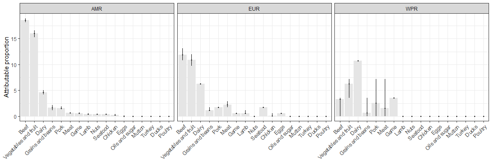<!-- -->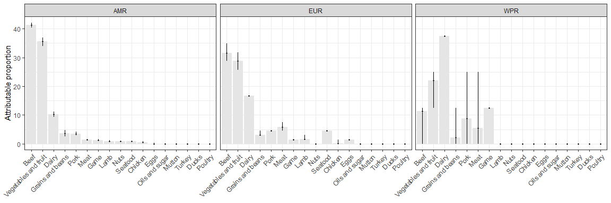<!-- -->

    ## 
    ## 
    ##                         mean   2.5%   97.5%   mean   2.5%   97.5%   mean   2.5%   97.5%
    ## ---------------------  -----  -----  ------  -----  -----  ------  -----  -----  ------
    ## Eggs                     0.0    0.0     0.2    0.6    0.6     0.6    0.0    0.0     0.0
    ## Dairy                    4.6    4.2     5.0    6.3    6.3     6.3   10.7   10.7    10.7
    ## Meat                     0.6    0.6     0.8    2.2    1.7     2.9    1.6    0.0     7.1
    ## Poultry                  0.0    0.0     0.0    0.0    0.0     0.0    0.0    0.0     0.0
    ## Chicken                  0.2    0.2     0.4    0.1    0.0     0.6    0.0    0.0     0.0
    ## Ducks                    0.0    0.0     0.0    0.0    0.0     0.0    0.0    0.0     0.0
    ## Turkey                   0.0    0.0     0.0    0.0    0.0     0.0    0.0    0.0     0.0
    ## Beef                    18.6   18.1    18.9   11.9   10.9    13.1    3.3    0.0     3.6
    ## Pork                     1.6    1.4     1.9    1.7    1.7     1.7    2.5    0.0     7.1
    ## Lamb                     0.4    0.4     0.6    0.6    0.6     1.1    0.0    0.0     0.0
    ## Mutton                   0.0    0.0     0.0    0.0    0.0     0.0    0.0    0.0     0.0
    ## Game                     0.6    0.6     0.8    0.6    0.6     0.6    3.6    3.6     3.6
    ## Vegetables and fruit    16.0   15.3    16.6   10.9    9.7    12.0    6.3    3.6     7.1
    ## Grains and beans         1.6    1.2     2.1    1.2    1.1     1.7    0.6    0.0     3.6
    ## Seafood                  0.4    0.4     0.4    1.7    1.7     1.7    0.0    0.0     0.0
    ## Nuts                     0.4    0.4     0.4    0.0    0.0     0.0    0.0    0.0     0.0
    ## Oils and sugar           0.0    0.0     0.0    0.0    0.0     0.0    0.0    0.0     0.0
    ## Unknown                 55.0   55.0    55.0   62.3   62.3    62.3   71.4   71.4    71.4
    ## 
    ## 
    ##                         mean   2.5%   97.5%   mean   2.5%   97.5%   mean   2.5%   97.5%
    ## ---------------------  -----  -----  ------  -----  -----  ------  -----  -----  ------
    ## Eggs                     0.0    0.0     0.4    1.5    1.5     1.5    0.0    0.0     0.0
    ## Dairy                   10.2    9.4    11.2   16.7   16.7    16.7   37.5   37.5    37.5
    ## Meat                     1.4    1.3     1.7    6.0    4.5     7.6    5.5    0.0    25.0
    ## Poultry                  0.0    0.0     0.0    0.0    0.0     0.0    0.0    0.0     0.0
    ## Chicken                  0.4    0.4     0.9    0.2    0.0     1.5    0.0    0.0     0.0
    ## Ducks                    0.0    0.0     0.0    0.0    0.0     0.0    0.0    0.0     0.0
    ## Turkey                   0.0    0.0     0.0    0.0    0.0     0.0    0.0    0.0     0.0
    ## Beef                    41.3   40.3    42.1   31.5   28.8    34.8   11.4    0.0    12.5
    ## Pork                     3.6    3.0     4.3    4.5    4.5     4.5    8.9    0.0    25.0
    ## Lamb                     1.0    0.9     1.3    1.6    1.5     3.0    0.0    0.0     0.0
    ## Mutton                   0.0    0.0     0.0    0.0    0.0     0.0    0.0    0.0     0.0
    ## Game                     1.3    1.3     1.7    1.5    1.5     1.5   12.5   12.5    12.5
    ## Vegetables and fruit    35.5   33.9    36.9   28.9   25.8    31.8   22.1   12.5    25.0
    ## Grains and beans         3.6    2.6     4.7    3.1    3.0     4.5    2.1    0.0    12.5
    ## Seafood                  0.9    0.9     0.9    4.5    4.5     4.5    0.0    0.0     0.0
    ## Nuts                     0.9    0.9     0.9    0.0    0.0     0.0    0.0    0.0     0.0
    ## Oils and sugar           0.0    0.0     0.0    0.0    0.0     0.0    0.0    0.0     0.0

# MORTALITY

``` r
table(dta$Num_Deaths, useNA = "always")
```

    ## 
    ##    .    0    1   10    2    5   53    7   NA <NA> 
    ##   58  819   35    1    6    1    1    1    2   33

``` r
dta$Num_Deaths[is.na(dta$Num_Deaths)] <- 0
dta$Num_Deaths[dta$Num_Deaths == "."] <- 0
dta$Num_Deaths[dta$Num_Deaths == "NA"] <- 0
table(dta$Num_Deaths, useNA = "always")
```

    ## 
    ##    0    1   10    2    5   53    7 <NA> 
    ##  912   35    1    6    1    1    1    0

``` r
is_mrt <- dta$Num_Deaths != "0"
table(is_mrt)
```

    ## is_mrt
    ## FALSE  TRUE 
    ##   912    45

``` r
###
### WITH MRT
###

## subset data
dta_mrt <- dta[is_mrt, ]
str(dta_mrt)
```

    ## 'data.frame':    45 obs. of  52 variables:
    ##  $ id                  : chr  "4" "7" "14" "20" ...
    ##  $ Year                : chr  "1982" "2002" "2013" "2011" ...
    ##  $ Country             : chr  "Canada" "Canada" "Canada" "Canada" ...
    ##  $ WHO_Region          : chr  "AMRO" "AMRO" "AMRO" "AMRO" ...
    ##  $ fboStrengthStrong   : chr  NA NA NA NA ...
    ##  $ Agent               : chr  "STEC" "STEC" "STEC" "Verotoxigenic E. coli (VTEC)" ...
    ##  $ Serotype            : chr  "O157:H7" "O157:H7" "O157:H7" "O157" ...
    ##  $ Virulence_factors   : chr  NA NA "stx1, stx2, eae" NA ...
    ##  $ fboCode             : chr  NA NA NA NA ...
    ##  $ fboOtherAgents      : chr  NA NA NA NA ...
    ##  $ Outb_Type           : chr  NA NA NA NA ...
    ##  $ Vehicle             : chr  "hamburger" "vegetables prepared on site / cook had diarrhea preceding outbreak" "Raw milk cheese" NA ...
    ##  $ VehicleInfo         : chr  NA NA NA "Foodborne" ...
    ##  $ Evidence            : chr  "Epidemiological" "Epidemiological" "Laboratory confirmation" "Strong" ...
    ##  $ Setting             : chr  "Old age home" "Hospital" "home" "Community" ...
    ##  $ PlaceOrigin         : chr  NA NA NA NA ...
    ##  $ VehicleOrigin       : chr  NA NA NA NA ...
    ##  $ Risk_oFactor        : chr  NA NA NA NA ...
    ##  $ Num_Outbreaks       : num  NA NA NA NA NA NA NA NA NA NA ...
    ##  $ numHumanCases_str   : chr  "353" "109" "29" "14" ...
    ##  $ Num_Cases           : num  353 109 29 14 12 8 28 32 25 15 ...
    ##  $ numHospitalised_str : chr  "4" "NA" "NA" "11" ...
    ##  $ Num_Hospitalised    : chr  "4" "NA" "NA" "11" ...
    ##  $ HUS                 : chr  "0" "0" "0" "3" ...
    ##  $ numDeaths_str       : chr  "1" "2" "1" "1" ...
    ##  $ Num_Deaths          : chr  "1" "2" "1" "1" ...
    ##  $ Comments            : chr  NA NA NA NA ...
    ##  $ footnote            : chr  NA NA NA NA ...
    ##  $ Source              : chr  NA NA NA "Raw, shelled walnuts." ...
    ##  $ Food                : chr  "hamburger" "vegetables prepared on site / cook had diarrhea preceding outbreak" "Raw milk cheese" NA ...
    ##  $ Total               : num  NA NA NA NA NA NA NA 1 1 1 ...
    ##  $ Unknown_NA          : num  NA NA NA NA NA NA NA NA NA NA ...
    ##  $ Complex_Simple      : chr  "S" "S" "S" "S" ...
    ##  $ Eggs                : num  0 0 0 0 0 0 0 0 0 0 ...
    ##  $ Dairy               : num  0 0 1 0 0 0 1 0 0 0 ...
    ##  $ Meat                : num  0 0 0 0 0 0 0 0 1 0 ...
    ##  $ Poultry             : num  0 0 0 0 0 0 0 0 0 0 ...
    ##  $ Chicken             : num  0 0 0 0 0 0 0 0 0 0 ...
    ##  $ Ducks               : num  0 0 0 0 0 0 0 0 0 0 ...
    ##  $ Turkey              : num  0 0 0 0 0 0 0 0 0 0 ...
    ##  $ Beef                : num  1 0 0 0 1 1 0 1 0 0 ...
    ##  $ Pork                : num  0 0 0 0 0 0 0 0 0 0 ...
    ##  $ Lamb                : num  0 0 0 0 0 0 0 0 0 0 ...
    ##  $ Mutton              : num  0 0 0 0 0 0 0 0 0 0 ...
    ##  $ Game                : num  0 0 0 0 0 0 0 0 0 0 ...
    ##  $ Vegetables and fruit: num  0 1 0 0 0 0 0 0 0 1 ...
    ##  $ Grains and beans    : num  0 0 0 0 0 0 0 0 0 0 ...
    ##  $ Seafood             : num  0 0 0 0 0 0 0 0 0 0 ...
    ##  $ Nuts                : num  0 0 0 1 0 0 0 0 0 0 ...
    ##  $ Oils and sugar      : num  0 0 0 0 0 0 0 0 0 0 ...
    ##  $ check               : num  1 1 1 1 1 1 1 1 1 1 ...
    ##  $ Region_Type         : chr  "AMRO S" "AMRO S" "AMRO S" "AMRO S" ...

``` r
## extract ALL outbreak data
F_mrt <- dta_mrt[, 34:50]; str(F_mrt)
```

    ## 'data.frame':    45 obs. of  17 variables:
    ##  $ Eggs                : num  0 0 0 0 0 0 0 0 0 0 ...
    ##  $ Dairy               : num  0 0 1 0 0 0 1 0 0 0 ...
    ##  $ Meat                : num  0 0 0 0 0 0 0 0 1 0 ...
    ##  $ Poultry             : num  0 0 0 0 0 0 0 0 0 0 ...
    ##  $ Chicken             : num  0 0 0 0 0 0 0 0 0 0 ...
    ##  $ Ducks               : num  0 0 0 0 0 0 0 0 0 0 ...
    ##  $ Turkey              : num  0 0 0 0 0 0 0 0 0 0 ...
    ##  $ Beef                : num  1 0 0 0 1 1 0 1 0 0 ...
    ##  $ Pork                : num  0 0 0 0 0 0 0 0 0 0 ...
    ##  $ Lamb                : num  0 0 0 0 0 0 0 0 0 0 ...
    ##  $ Mutton              : num  0 0 0 0 0 0 0 0 0 0 ...
    ##  $ Game                : num  0 0 0 0 0 0 0 0 0 0 ...
    ##  $ Vegetables and fruit: num  0 1 0 0 0 0 0 0 0 1 ...
    ##  $ Grains and beans    : num  0 0 0 0 0 0 0 0 0 0 ...
    ##  $ Seafood             : num  0 0 0 0 0 0 0 0 0 0 ...
    ##  $ Nuts                : num  0 0 0 1 0 0 0 0 0 0 ...
    ##  $ Oils and sugar      : num  0 0 0 0 0 0 0 0 0 0 ...

``` r
sort(colSums(F_mrt), decreasing = TRUE)
```

    ## Vegetables and fruit                 Beef                Dairy 
    ##                   12                    9                    3 
    ##                 Eggs                 Meat                 Nuts 
    ##                    1                    1                    1 
    ##              Poultry              Chicken                Ducks 
    ##                    0                    0                    0 
    ##               Turkey                 Pork                 Lamb 
    ##                    0                    0                    0 
    ##               Mutton                 Game     Grains and beans 
    ##                    0                    0                    0 
    ##              Seafood       Oils and sugar 
    ##                    0                    0

``` r
table(rowSums(F_mrt))
```

    ## 
    ##  0  1  3 
    ## 20 24  1

``` r
## extract SIMPLE outbreak data
S_mrt <- dta_mrt[dta_mrt$Complex_Simple == "S", 34:50]; str(S_mrt)
```

    ## 'data.frame':    24 obs. of  17 variables:
    ##  $ Eggs                : num  0 0 0 0 0 0 0 0 0 0 ...
    ##  $ Dairy               : num  0 0 1 0 0 0 1 0 0 0 ...
    ##  $ Meat                : num  0 0 0 0 0 0 0 0 1 0 ...
    ##  $ Poultry             : num  0 0 0 0 0 0 0 0 0 0 ...
    ##  $ Chicken             : num  0 0 0 0 0 0 0 0 0 0 ...
    ##  $ Ducks               : num  0 0 0 0 0 0 0 0 0 0 ...
    ##  $ Turkey              : num  0 0 0 0 0 0 0 0 0 0 ...
    ##  $ Beef                : num  1 0 0 0 1 1 0 1 0 0 ...
    ##  $ Pork                : num  0 0 0 0 0 0 0 0 0 0 ...
    ##  $ Lamb                : num  0 0 0 0 0 0 0 0 0 0 ...
    ##  $ Mutton              : num  0 0 0 0 0 0 0 0 0 0 ...
    ##  $ Game                : num  0 0 0 0 0 0 0 0 0 0 ...
    ##  $ Vegetables and fruit: num  0 1 0 0 0 0 0 0 0 1 ...
    ##  $ Grains and beans    : num  0 0 0 0 0 0 0 0 0 0 ...
    ##  $ Seafood             : num  0 0 0 0 0 0 0 0 0 0 ...
    ##  $ Nuts                : num  0 0 0 1 0 0 0 0 0 0 ...
    ##  $ Oils and sugar      : num  0 0 0 0 0 0 0 0 0 0 ...

``` r
sort(colSums(S_mrt), decreasing = TRUE)
```

    ## Vegetables and fruit                 Beef                Dairy 
    ##                   11                    8                    3 
    ##                 Meat                 Nuts                 Eggs 
    ##                    1                    1                    0 
    ##              Poultry              Chicken                Ducks 
    ##                    0                    0                    0 
    ##               Turkey                 Pork                 Lamb 
    ##                    0                    0                    0 
    ##               Mutton                 Game     Grains and beans 
    ##                    0                    0                    0 
    ##              Seafood       Oils and sugar 
    ##                    0                    0

``` r
table(rowSums(S_mrt))  # all == 1 ?
```

    ## 
    ##  1 
    ## 24

``` r
## apply outbreak model
outbreak_model(n, dta_mrt, F_mrt, S_mrt)
```

    ## 
    ## 
    ##                          mean    2.5%   97.5%
    ## ---------------------  ------  ------  ------
    ## Vegetables and fruit    0.458   0.265   0.654
    ## Beef                    0.334   0.164   0.534
    ## Dairy                   0.125   0.027   0.279
    ## Meat                    0.042   0.001   0.144
    ## Nuts                    0.041   0.001   0.147
    ## Oils and sugar          0.000   0.000   0.000
    ## Seafood                 0.000   0.000   0.000
    ## Grains and beans        0.000   0.000   0.000
    ## Game                    0.000   0.000   0.000
    ## Mutton                  0.000   0.000   0.000
    ## Lamb                    0.000   0.000   0.000
    ## Pork                    0.000   0.000   0.000
    ## Turkey                  0.000   0.000   0.000
    ## Ducks                   0.000   0.000   0.000
    ## Chicken                 0.000   0.000   0.000
    ## Poultry                 0.000   0.000   0.000
    ## Eggs                    0.000   0.000   0.000

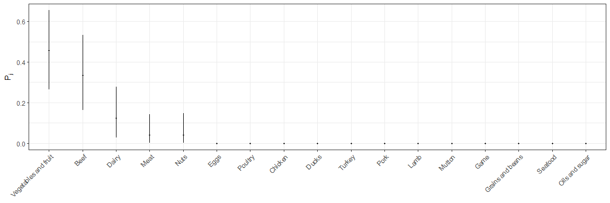<!-- -->

    ## 
    ## 
    ##                         sourceSAMRO   sourceSEURO   sourceSWPRO
    ## ---------------------  ------------  ------------  ------------
    ## Vegetables and fruit              8             2             1
    ## Beef                              8             0             0
    ## Dairy                             3             0             0
    ## Nuts                              1             0             0
    ## Meat                              1             0             0
    ## Oils and sugar                    0             0             0
    ## Seafood                           0             0             0
    ## Grains and beans                  0             0             0
    ## Game                              0             0             0
    ## Mutton                            0             0             0
    ## Lamb                              0             0             0
    ## Pork                              0             0             0
    ## Turkey                            0             0             0
    ## Ducks                             0             0             0
    ## Chicken                           0             0             0
    ## Poultry                           0             0             0
    ## Eggs                              0             0             0
    ##  int [1:17, 1, 1:10000, 1:20] 0 0 0 0 0 0 0 0 0 0 ...
    ##  num [1:20] 0 0 0 0 0 0 0 0 0 0 ...
    ##  num [1:20] 0 0 0 0 0 0 0 0 0 0 ...
    ##  int [1:17, 1:200000] 0 0 0 0 0 0 0 0 0 0 ...
    ##  num [1:17, 1:200000] 0 0 0 0 0 0 0 0 0 0 ...
    ##  num [1:17, 1:200000] 0 0 0 0 0 0 0 0 0 0 ...
    ## 
    ## 
    ##                         mean   2.5%   97.5%
    ## ---------------------  -----  -----  ------
    ## Vegetables and fruit     0.6      0       1
    ## Beef                     0.4      0       1
    ## Oils and sugar           0.0      0       0
    ## Nuts                     0.0      0       0
    ## Seafood                  0.0      0       0
    ## Grains and beans         0.0      0       0
    ## Game                     0.0      0       0
    ## Mutton                   0.0      0       0
    ## Lamb                     0.0      0       0
    ## Pork                     0.0      0       0
    ## Turkey                   0.0      0       0
    ## Ducks                    0.0      0       0
    ## Chicken                  0.0      0       0
    ## Poultry                  0.0      0       0
    ## Meat                     0.0      0       0
    ## Dairy                    0.0      0       0
    ## Eggs                     0.0      0       0
    ## 
    ## 
    ##                         mean   2.5%   97.5%
    ## ---------------------  -----  -----  ------
    ## Oils and sugar             0      0       0
    ## Nuts                       0      0       0
    ## Seafood                    0      0       0
    ## Grains and beans           0      0       0
    ## Vegetables and fruit       0      0       0
    ## Game                       0      0       0
    ## Mutton                     0      0       0
    ## Lamb                       0      0       0
    ## Pork                       0      0       0
    ## Beef                       0      0       0
    ## Turkey                     0      0       0
    ## Ducks                      0      0       0
    ## Chicken                    0      0       0
    ## Poultry                    0      0       0
    ## Meat                       0      0       0
    ## Dairy                      0      0       0
    ## Eggs                       0      0       0
    ## 
    ## 
    ##                         mean   2.5%   97.5%
    ## ---------------------  -----  -----  ------
    ## Oils and sugar             0      0       0
    ## Nuts                       0      0       0
    ## Seafood                    0      0       0
    ## Grains and beans           0      0       0
    ## Vegetables and fruit       0      0       0
    ## Game                       0      0       0
    ## Mutton                     0      0       0
    ## Lamb                       0      0       0
    ## Pork                       0      0       0
    ## Beef                       0      0       0
    ## Turkey                     0      0       0
    ## Ducks                      0      0       0
    ## Chicken                    0      0       0
    ## Poultry                    0      0       0
    ## Meat                       0      0       0
    ## Dairy                      0      0       0
    ## Eggs                       0      0       0
    ## 
    ## 
    ##                         mean   2.5%   97.5%
    ## ---------------------  -----  -----  ------
    ## Vegetables and fruit     8.6      8       9
    ## Beef                     8.4      8       9
    ## Dairy                    3.0      3       3
    ## Nuts                     1.0      1       1
    ## Meat                     1.0      1       1
    ## Oils and sugar           0.0      0       0
    ## Seafood                  0.0      0       0
    ## Grains and beans         0.0      0       0
    ## Game                     0.0      0       0
    ## Mutton                   0.0      0       0
    ## Lamb                     0.0      0       0
    ## Pork                     0.0      0       0
    ## Turkey                   0.0      0       0
    ## Ducks                    0.0      0       0
    ## Chicken                  0.0      0       0
    ## Poultry                  0.0      0       0
    ## Eggs                     0.0      0       0
    ## 
    ## 
    ##                         mean   2.5%   97.5%
    ## ---------------------  -----  -----  ------
    ## Vegetables and fruit       2      2       2
    ## Oils and sugar             0      0       0
    ## Nuts                       0      0       0
    ## Seafood                    0      0       0
    ## Grains and beans           0      0       0
    ## Game                       0      0       0
    ## Mutton                     0      0       0
    ## Lamb                       0      0       0
    ## Pork                       0      0       0
    ## Beef                       0      0       0
    ## Turkey                     0      0       0
    ## Ducks                      0      0       0
    ## Chicken                    0      0       0
    ## Poultry                    0      0       0
    ## Meat                       0      0       0
    ## Dairy                      0      0       0
    ## Eggs                       0      0       0
    ## 
    ## 
    ##                         mean   2.5%   97.5%
    ## ---------------------  -----  -----  ------
    ## Vegetables and fruit       1      1       1
    ## Oils and sugar             0      0       0
    ## Nuts                       0      0       0
    ## Seafood                    0      0       0
    ## Grains and beans           0      0       0
    ## Game                       0      0       0
    ## Mutton                     0      0       0
    ## Lamb                       0      0       0
    ## Pork                       0      0       0
    ## Beef                       0      0       0
    ## Turkey                     0      0       0
    ## Ducks                      0      0       0
    ## Chicken                    0      0       0
    ## Poultry                    0      0       0
    ## Meat                       0      0       0
    ## Dairy                      0      0       0
    ## Eggs                       0      0       0
    ## 
    ## 
    ##                         mean   2.5%   97.5%
    ## ---------------------  -----  -----  ------
    ## Unknown                 47.6   47.6    47.6
    ## Vegetables and fruit    20.4   19.0    21.4
    ## Beef                    20.1   19.0    21.4
    ## Dairy                    7.1    7.1     7.1
    ## Nuts                     2.4    2.4     2.4
    ## Meat                     2.4    2.4     2.4
    ## Oils and sugar           0.0    0.0     0.0
    ## Seafood                  0.0    0.0     0.0
    ## Grains and beans         0.0    0.0     0.0
    ## Game                     0.0    0.0     0.0
    ## Mutton                   0.0    0.0     0.0
    ## Lamb                     0.0    0.0     0.0
    ## Pork                     0.0    0.0     0.0
    ## Turkey                   0.0    0.0     0.0
    ## Ducks                    0.0    0.0     0.0
    ## Chicken                  0.0    0.0     0.0
    ## Poultry                  0.0    0.0     0.0
    ## Eggs                     0.0    0.0     0.0
    ## 
    ## 
    ##                         mean   2.5%   97.5%
    ## ---------------------  -----  -----  ------
    ## Vegetables and fruit     100    100     100
    ## Unknown                    0      0       0
    ## Oils and sugar             0      0       0
    ## Nuts                       0      0       0
    ## Seafood                    0      0       0
    ## Grains and beans           0      0       0
    ## Game                       0      0       0
    ## Mutton                     0      0       0
    ## Lamb                       0      0       0
    ## Pork                       0      0       0
    ## Beef                       0      0       0
    ## Turkey                     0      0       0
    ## Ducks                      0      0       0
    ## Chicken                    0      0       0
    ## Poultry                    0      0       0
    ## Meat                       0      0       0
    ## Dairy                      0      0       0
    ## Eggs                       0      0       0
    ## 
    ## 
    ##                         mean   2.5%   97.5%
    ## ---------------------  -----  -----  ------
    ## Vegetables and fruit     100    100     100
    ## Unknown                    0      0       0
    ## Oils and sugar             0      0       0
    ## Nuts                       0      0       0
    ## Seafood                    0      0       0
    ## Grains and beans           0      0       0
    ## Game                       0      0       0
    ## Mutton                     0      0       0
    ## Lamb                       0      0       0
    ## Pork                       0      0       0
    ## Beef                       0      0       0
    ## Turkey                     0      0       0
    ## Ducks                      0      0       0
    ## Chicken                    0      0       0
    ## Poultry                    0      0       0
    ## Meat                       0      0       0
    ## Dairy                      0      0       0
    ## Eggs                       0      0       0
    ## 
    ## 
    ##                         mean   2.5%   97.5%
    ## ---------------------  -----  -----  ------
    ## Vegetables and fruit    39.0   36.4    40.9
    ## Beef                    38.3   36.4    40.9
    ## Dairy                   13.6   13.6    13.6
    ## Nuts                     4.5    4.5     4.5
    ## Meat                     4.5    4.5     4.5
    ## Oils and sugar           0.0    0.0     0.0
    ## Seafood                  0.0    0.0     0.0
    ## Grains and beans         0.0    0.0     0.0
    ## Game                     0.0    0.0     0.0
    ## Mutton                   0.0    0.0     0.0
    ## Lamb                     0.0    0.0     0.0
    ## Pork                     0.0    0.0     0.0
    ## Turkey                   0.0    0.0     0.0
    ## Ducks                    0.0    0.0     0.0
    ## Chicken                  0.0    0.0     0.0
    ## Poultry                  0.0    0.0     0.0
    ## Eggs                     0.0    0.0     0.0
    ## 
    ## 
    ##                         mean   2.5%   97.5%
    ## ---------------------  -----  -----  ------
    ## Vegetables and fruit     100    100     100
    ## Oils and sugar             0      0       0
    ## Nuts                       0      0       0
    ## Seafood                    0      0       0
    ## Grains and beans           0      0       0
    ## Game                       0      0       0
    ## Mutton                     0      0       0
    ## Lamb                       0      0       0
    ## Pork                       0      0       0
    ## Beef                       0      0       0
    ## Turkey                     0      0       0
    ## Ducks                      0      0       0
    ## Chicken                    0      0       0
    ## Poultry                    0      0       0
    ## Meat                       0      0       0
    ## Dairy                      0      0       0
    ## Eggs                       0      0       0
    ## 
    ## 
    ##                         mean   2.5%   97.5%
    ## ---------------------  -----  -----  ------
    ## Vegetables and fruit     100    100     100
    ## Oils and sugar             0      0       0
    ## Nuts                       0      0       0
    ## Seafood                    0      0       0
    ## Grains and beans           0      0       0
    ## Game                       0      0       0
    ## Mutton                     0      0       0
    ## Lamb                       0      0       0
    ## Pork                       0      0       0
    ## Beef                       0      0       0
    ## Turkey                     0      0       0
    ## Ducks                      0      0       0
    ## Chicken                    0      0       0
    ## Poultry                    0      0       0
    ## Meat                       0      0       0
    ## Dairy                      0      0       0
    ## Eggs                       0      0       0

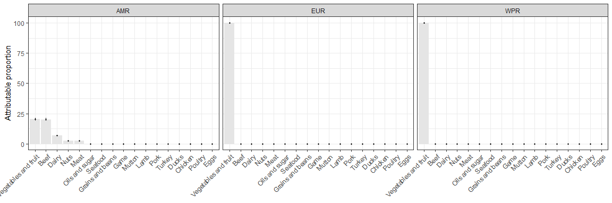<!-- -->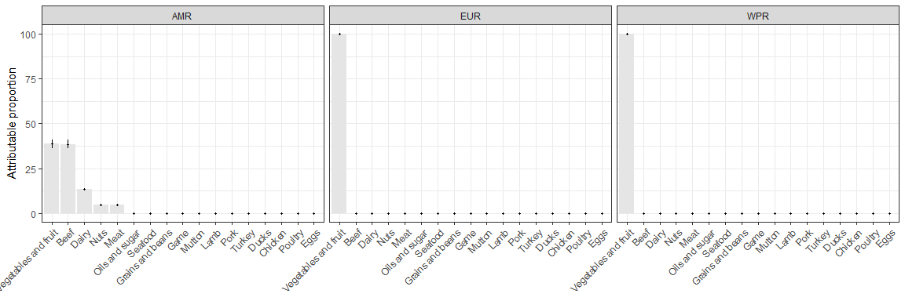<!-- -->

    ## 
    ## 
    ##                         mean   2.5%   97.5%   mean   2.5%   97.5%   mean   2.5%   97.5%
    ## ---------------------  -----  -----  ------  -----  -----  ------  -----  -----  ------
    ## Eggs                     0.0    0.0     0.0      0      0       0      0      0       0
    ## Dairy                    7.1    7.1     7.1      0      0       0      0      0       0
    ## Meat                     2.4    2.4     2.4      0      0       0      0      0       0
    ## Poultry                  0.0    0.0     0.0      0      0       0      0      0       0
    ## Chicken                  0.0    0.0     0.0      0      0       0      0      0       0
    ## Ducks                    0.0    0.0     0.0      0      0       0      0      0       0
    ## Turkey                   0.0    0.0     0.0      0      0       0      0      0       0
    ## Beef                    20.1   19.0    21.4      0      0       0      0      0       0
    ## Pork                     0.0    0.0     0.0      0      0       0      0      0       0
    ## Lamb                     0.0    0.0     0.0      0      0       0      0      0       0
    ## Mutton                   0.0    0.0     0.0      0      0       0      0      0       0
    ## Game                     0.0    0.0     0.0      0      0       0      0      0       0
    ## Vegetables and fruit    20.4   19.0    21.4    100    100     100    100    100     100
    ## Grains and beans         0.0    0.0     0.0      0      0       0      0      0       0
    ## Seafood                  0.0    0.0     0.0      0      0       0      0      0       0
    ## Nuts                     2.4    2.4     2.4      0      0       0      0      0       0
    ## Oils and sugar           0.0    0.0     0.0      0      0       0      0      0       0
    ## Unknown                 47.6   47.6    47.6      0      0       0      0      0       0
    ## 
    ## 
    ##                         mean   2.5%   97.5%   mean   2.5%   97.5%   mean   2.5%   97.5%
    ## ---------------------  -----  -----  ------  -----  -----  ------  -----  -----  ------
    ## Eggs                     0.0    0.0     0.0      0      0       0      0      0       0
    ## Dairy                   13.6   13.6    13.6      0      0       0      0      0       0
    ## Meat                     4.5    4.5     4.5      0      0       0      0      0       0
    ## Poultry                  0.0    0.0     0.0      0      0       0      0      0       0
    ## Chicken                  0.0    0.0     0.0      0      0       0      0      0       0
    ## Ducks                    0.0    0.0     0.0      0      0       0      0      0       0
    ## Turkey                   0.0    0.0     0.0      0      0       0      0      0       0
    ## Beef                    38.3   36.4    40.9      0      0       0      0      0       0
    ## Pork                     0.0    0.0     0.0      0      0       0      0      0       0
    ## Lamb                     0.0    0.0     0.0      0      0       0      0      0       0
    ## Mutton                   0.0    0.0     0.0      0      0       0      0      0       0
    ## Game                     0.0    0.0     0.0      0      0       0      0      0       0
    ## Vegetables and fruit    39.0   36.4    40.9    100    100     100    100    100     100
    ## Grains and beans         0.0    0.0     0.0      0      0       0      0      0       0
    ## Seafood                  0.0    0.0     0.0      0      0       0      0      0       0
    ## Nuts                     4.5    4.5     4.5      0      0       0      0      0       0
    ## Oils and sugar           0.0    0.0     0.0      0      0       0      0      0       0

``` r
###
### WITHOUT MRT
###

## subset data
dta_nomrt <- dta[!is_mrt, ]
str(dta_nomrt)
```

    ## 'data.frame':    912 obs. of  52 variables:
    ##  $ id                  : chr  "1" "2" "3" "5" ...
    ##  $ Year                : chr  "2003" "2011" "2014" "1994" ...
    ##  $ Country             : chr  "Argentina" "Argentina" "Argentina" "Canada" ...
    ##  $ WHO_Region          : chr  "AMRO" "AMRO" "AMRO" "AMRO" ...
    ##  $ fboStrengthStrong   : chr  NA NA NA NA ...
    ##  $ Agent               : chr  "Verotoxigenic E. coli (VTEC)" "Verotoxigenic E. coli (VTEC)" "Verotoxigenic E. coli (VTEC)" "STEC" ...
    ##  $ Serotype            : chr  NA NA NA "O157:H7" ...
    ##  $ Virulence_factors   : chr  NA NA NA NA ...
    ##  $ fboCode             : chr  NA NA NA NA ...
    ##  $ fboOtherAgents      : chr  NA NA NA NA ...
    ##  $ Outb_Type           : chr  NA NA NA NA ...
    ##  $ Vehicle             : chr  "Homemade hamburger" "Ground beef" "Ground beef" "Raw milk cheese" ...
    ##  $ VehicleInfo         : chr  "Homemade hamburger" "Ground beef" "Ground beef" NA ...
    ##  $ Evidence            : chr  "Epidemiologic and laboratory confirmation" "Epidemiologic and laboratory confirmation" "Epidemiologic and laboratory confirmation" "NA" ...
    ##  $ Setting             : chr  NA NA NA "home" ...
    ##  $ PlaceOrigin         : chr  NA NA NA NA ...
    ##  $ VehicleOrigin       : chr  NA NA NA NA ...
    ##  $ Risk_oFactor        : chr  NA NA NA NA ...
    ##  $ Num_Outbreaks       : num  NA NA NA NA NA NA NA NA NA NA ...
    ##  $ numHumanCases_str   : chr  NA NA NA "2" ...
    ##  $ Num_Cases           : num  1 1 1 2 79 13 6 16 29 5 ...
    ##  $ numHospitalised_str : chr  "1" "1" "1" "NA" ...
    ##  $ Num_Hospitalised    : chr  "1" "1" "1" "NA" ...
    ##  $ HUS                 : chr  "1" "1" "1" "0" ...
    ##  $ numDeaths_str       : chr  NA NA NA "0" ...
    ##  $ Num_Deaths          : chr  "0" "0" "0" "0" ...
    ##  $ Comments            : chr  NA NA NA NA ...
    ##  $ footnote            : chr  NA NA NA NA ...
    ##  $ Source              : chr  "Homemade hamburger" "Ground beef" "Ground beef" NA ...
    ##  $ Food                : chr  "Hamburger(ground beef*)" "Ground beef" "Ground beef" "Raw milk cheese" ...
    ##  $ Total               : num  NA NA NA NA NA NA NA NA NA NA ...
    ##  $ Unknown_NA          : num  NA NA NA NA NA NA NA NA NA NA ...
    ##  $ Complex_Simple      : chr  "S" "S" "S" "S" ...
    ##  $ Eggs                : num  0 0 0 0 0 0 0 0 0 0 ...
    ##  $ Dairy               : num  0 0 0 1 0 1 0 1 0 0 ...
    ##  $ Meat                : num  0 0 0 0 0 0 0 0 0 0 ...
    ##  $ Poultry             : num  0 0 0 0 0 0 0 0 0 0 ...
    ##  $ Chicken             : num  0 0 0 0 0 0 0 0 0 0 ...
    ##  $ Ducks               : num  0 0 0 0 0 0 0 0 0 0 ...
    ##  $ Turkey              : num  0 0 0 0 0 0 0 0 0 0 ...
    ##  $ Beef                : num  1 1 1 0 0 0 0 0 0 1 ...
    ##  $ Pork                : num  0 0 0 0 1 0 1 0 1 0 ...
    ##  $ Lamb                : num  0 0 0 0 0 0 0 0 0 0 ...
    ##  $ Mutton              : num  0 0 0 0 0 0 0 0 0 0 ...
    ##  $ Game                : num  0 0 0 0 0 0 0 0 0 0 ...
    ##  $ Vegetables and fruit: num  0 0 0 0 0 0 0 0 0 0 ...
    ##  $ Grains and beans    : num  0 0 0 0 0 0 0 0 0 0 ...
    ##  $ Seafood             : num  0 0 0 0 0 0 0 0 0 0 ...
    ##  $ Nuts                : num  0 0 0 0 0 0 0 0 0 0 ...
    ##  $ Oils and sugar      : num  0 0 0 0 0 0 0 0 0 0 ...
    ##  $ check               : num  1 1 1 1 1 1 1 1 1 1 ...
    ##  $ Region_Type         : chr  "AMRO S" "AMRO S" "AMRO S" "AMRO S" ...

``` r
## extract ALL outbreak data
F_nomrt <- dta_nomrt[, 34:50]; str(F_nomrt)
```

    ## 'data.frame':    912 obs. of  17 variables:
    ##  $ Eggs                : num  0 0 0 0 0 0 0 0 0 0 ...
    ##  $ Dairy               : num  0 0 0 1 0 1 0 1 0 0 ...
    ##  $ Meat                : num  0 0 0 0 0 0 0 0 0 0 ...
    ##  $ Poultry             : num  0 0 0 0 0 0 0 0 0 0 ...
    ##  $ Chicken             : num  0 0 0 0 0 0 0 0 0 0 ...
    ##  $ Ducks               : num  0 0 0 0 0 0 0 0 0 0 ...
    ##  $ Turkey              : num  0 0 0 0 0 0 0 0 0 0 ...
    ##  $ Beef                : num  1 1 1 0 0 0 0 0 0 1 ...
    ##  $ Pork                : num  0 0 0 0 1 0 1 0 1 0 ...
    ##  $ Lamb                : num  0 0 0 0 0 0 0 0 0 0 ...
    ##  $ Mutton              : num  0 0 0 0 0 0 0 0 0 0 ...
    ##  $ Game                : num  0 0 0 0 0 0 0 0 0 0 ...
    ##  $ Vegetables and fruit: num  0 0 0 0 0 0 0 0 0 0 ...
    ##  $ Grains and beans    : num  0 0 0 0 0 0 0 0 0 0 ...
    ##  $ Seafood             : num  0 0 0 0 0 0 0 0 0 0 ...
    ##  $ Nuts                : num  0 0 0 0 0 0 0 0 0 0 ...
    ##  $ Oils and sugar      : num  0 0 0 0 0 0 0 0 0 0 ...

``` r
sort(colSums(F_nomrt), decreasing = TRUE)
```

    ##                 Beef Vegetables and fruit                Dairy 
    ##                  155                  142                   58 
    ##     Grains and beans                 Meat                 Pork 
    ##                   28                   18                   17 
    ##              Chicken                 Eggs                 Lamb 
    ##                   11                    9                    7 
    ##                 Game              Seafood               Turkey 
    ##                    7                    6                    2 
    ##                 Nuts       Oils and sugar              Poultry 
    ##                    2                    2                    0 
    ##                Ducks               Mutton 
    ##                    0                    0

``` r
table(rowSums(F_nomrt))
```

    ## 
    ##   0   1   2   3   4 
    ## 519 337  43  11   2

``` r
## extract SIMPLE outbreak data
S_nomrt <- dta_nomrt[dta_nomrt$Complex_Simple == "S", 34:50]; str(S_nomrt)
```

    ## 'data.frame':    337 obs. of  17 variables:
    ##  $ Eggs                : num  0 0 0 0 0 0 0 0 0 0 ...
    ##  $ Dairy               : num  0 0 0 1 0 1 0 1 0 0 ...
    ##  $ Meat                : num  0 0 0 0 0 0 0 0 0 0 ...
    ##  $ Poultry             : num  0 0 0 0 0 0 0 0 0 0 ...
    ##  $ Chicken             : num  0 0 0 0 0 0 0 0 0 0 ...
    ##  $ Ducks               : num  0 0 0 0 0 0 0 0 0 0 ...
    ##  $ Turkey              : num  0 0 0 0 0 0 0 0 0 0 ...
    ##  $ Beef                : num  1 1 1 0 0 0 0 0 0 1 ...
    ##  $ Pork                : num  0 0 0 0 1 0 1 0 1 0 ...
    ##  $ Lamb                : num  0 0 0 0 0 0 0 0 0 0 ...
    ##  $ Mutton              : num  0 0 0 0 0 0 0 0 0 0 ...
    ##  $ Game                : num  0 0 0 0 0 0 0 0 0 0 ...
    ##  $ Vegetables and fruit: num  0 0 0 0 0 0 0 0 0 0 ...
    ##  $ Grains and beans    : num  0 0 0 0 0 0 0 0 0 0 ...
    ##  $ Seafood             : num  0 0 0 0 0 0 0 0 0 0 ...
    ##  $ Nuts                : num  0 0 0 0 0 0 0 0 0 0 ...
    ##  $ Oils and sugar      : num  0 0 0 0 0 0 0 0 0 0 ...

``` r
sort(colSums(S_nomrt), decreasing = TRUE)
```

    ##                 Beef Vegetables and fruit                Dairy 
    ##                  135                  105                   46 
    ##                 Pork                 Meat     Grains and beans 
    ##                   11                   10                   10 
    ##                 Game              Seafood                 Lamb 
    ##                    6                    6                    4 
    ##                 Nuts                 Eggs              Chicken 
    ##                    2                    1                    1 
    ##              Poultry                Ducks               Turkey 
    ##                    0                    0                    0 
    ##               Mutton       Oils and sugar 
    ##                    0                    0

``` r
table(rowSums(S_nomrt))  # all == 1 ?
```

    ## 
    ##   1 
    ## 337

``` r
## apply outbreak model
outbreak_model(n, dta_nomrt, F_nomrt, S_nomrt)
```

    ## 
    ## 
    ##                          mean    2.5%   97.5%
    ## ---------------------  ------  ------  ------
    ## Beef                    0.401   0.349   0.454
    ## Vegetables and fruit    0.311   0.264   0.362
    ## Dairy                   0.137   0.102   0.176
    ## Pork                    0.033   0.017   0.053
    ## Meat                    0.030   0.014   0.050
    ## Grains and beans        0.030   0.014   0.050
    ## Seafood                 0.018   0.007   0.035
    ## Game                    0.018   0.007   0.034
    ## Lamb                    0.012   0.003   0.026
    ## Nuts                    0.006   0.001   0.017
    ## Chicken                 0.003   0.000   0.011
    ## Eggs                    0.003   0.000   0.011
    ## Oils and sugar          0.000   0.000   0.000
    ## Mutton                  0.000   0.000   0.000
    ## Turkey                  0.000   0.000   0.000
    ## Ducks                   0.000   0.000   0.000
    ## Poultry                 0.000   0.000   0.000

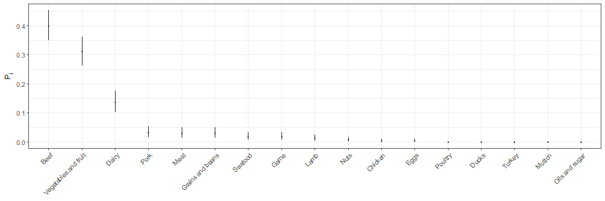<!-- -->

    ## 
    ## 
    ##                         sourceSAMRO   sourceSEURO   sourceSWPRO
    ## ---------------------  ------------  ------------  ------------
    ## Beef                            117            18             0
    ## Vegetables and fruit             89            14             2
    ## Dairy                            32            11             3
    ## Grains and beans                  8             2             0
    ## Pork                              8             3             0
    ## Meat                              7             3             0
    ## Game                              4             1             1
    ## Seafood                           3             3             0
    ## Lamb                              3             1             0
    ## Nuts                              2             0             0
    ## Chicken                           1             0             0
    ## Oils and sugar                    0             0             0
    ## Mutton                            0             0             0
    ## Turkey                            0             0             0
    ## Ducks                             0             0             0
    ## Poultry                           0             0             0
    ## Eggs                              0             1             0
    ##  int [1:17, 1:44, 1:10000, 1:20] 0 0 0 0 0 0 0 1 0 0 ...
    ##  int [1:17, 1:8, 1:10000, 1:20] 0 0 0 0 1 0 0 0 0 0 ...
    ##  int [1:17, 1:4, 1:10000, 1:20] 0 0 0 0 0 0 0 0 0 0 ...
    ##  int [1:17, 1:200000] 0 7 0 0 0 0 0 11 2 0 ...
    ##  int [1:17, 1:200000] 0 0 0 0 1 0 0 1 0 0 ...
    ##  int [1:17, 1:200000] 0 0 0 0 0 0 0 1 1 0 ...
    ## 
    ## 
    ##                         mean   2.5%   97.5%
    ## ---------------------  -----  -----  ------
    ## Vegetables and fruit    22.3     19      26
    ## Beef                    10.8      8      13
    ## Dairy                    6.2      4       9
    ## Grains and beans         2.7      0       6
    ## Pork                     1.2      0       3
    ## Lamb                     0.3      0       1
    ## Meat                     0.3      0       2
    ## Eggs                     0.1      0       1
    ## Chicken                  0.1      0       1
    ## Game                     0.0      0       1
    ## Oils and sugar           0.0      0       0
    ## Nuts                     0.0      0       0
    ## Seafood                  0.0      0       0
    ## Mutton                   0.0      0       0
    ## Turkey                   0.0      0       0
    ## Ducks                    0.0      0       0
    ## Poultry                  0.0      0       0
    ## 
    ## 
    ##                         mean   2.5%   97.5%
    ## ---------------------  -----  -----  ------
    ## Vegetables and fruit     4.0      2       6
    ## Beef                     2.8      1       5
    ## Meat                     1.0      0       2
    ## Chicken                  0.1      0       1
    ## Grains and beans         0.0      0       1
    ## Lamb                     0.0      0       1
    ## Oils and sugar           0.0      0       0
    ## Nuts                     0.0      0       0
    ## Seafood                  0.0      0       0
    ## Game                     0.0      0       0
    ## Mutton                   0.0      0       0
    ## Pork                     0.0      0       0
    ## Turkey                   0.0      0       0
    ## Ducks                    0.0      0       0
    ## Poultry                  0.0      0       0
    ## Dairy                    0.0      0       0
    ## Eggs                     0.0      0       0
    ## 
    ## 
    ##                         mean   2.5%   97.5%
    ## ---------------------  -----  -----  ------
    ## Vegetables and fruit     1.8      1       2
    ## Beef                     0.9      0       1
    ## Pork                     0.6      0       2
    ## Meat                     0.6      0       2
    ## Grains and beans         0.2      0       1
    ## Oils and sugar           0.0      0       0
    ## Nuts                     0.0      0       0
    ## Seafood                  0.0      0       0
    ## Game                     0.0      0       0
    ## Mutton                   0.0      0       0
    ## Lamb                     0.0      0       0
    ## Turkey                   0.0      0       0
    ## Ducks                    0.0      0       0
    ## Chicken                  0.0      0       0
    ## Poultry                  0.0      0       0
    ## Dairy                    0.0      0       0
    ## Eggs                     0.0      0       0
    ## 
    ## 
    ##                          mean   2.5%   97.5%
    ## ---------------------  ------  -----  ------
    ## Beef                    127.8    125     130
    ## Vegetables and fruit    111.3    108     115
    ## Dairy                    38.2     36      41
    ## Grains and beans         10.7      8      14
    ## Pork                      9.2      8      11
    ## Meat                      7.3      7       9
    ## Game                      4.0      4       5
    ## Lamb                      3.3      3       4
    ## Seafood                   3.0      3       3
    ## Nuts                      2.0      2       2
    ## Chicken                   1.1      1       2
    ## Eggs                      0.1      0       1
    ## Oils and sugar            0.0      0       0
    ## Mutton                    0.0      0       0
    ## Turkey                    0.0      0       0
    ## Ducks                     0.0      0       0
    ## Poultry                   0.0      0       0
    ## 
    ## 
    ##                         mean   2.5%   97.5%
    ## ---------------------  -----  -----  ------
    ## Beef                    20.8     19      23
    ## Vegetables and fruit    18.0     16      20
    ## Dairy                   11.0     11      11
    ## Meat                     4.0      3       5
    ## Seafood                  3.0      3       3
    ## Pork                     3.0      3       3
    ## Grains and beans         2.0      2       3
    ## Lamb                     1.0      1       2
    ## Game                     1.0      1       1
    ## Eggs                     1.0      1       1
    ## Chicken                  0.1      0       1
    ## Oils and sugar           0.0      0       0
    ## Nuts                     0.0      0       0
    ## Mutton                   0.0      0       0
    ## Turkey                   0.0      0       0
    ## Ducks                    0.0      0       0
    ## Poultry                  0.0      0       0
    ## 
    ## 
    ##                         mean   2.5%   97.5%
    ## ---------------------  -----  -----  ------
    ## Vegetables and fruit     3.8      3       4
    ## Dairy                    3.0      3       3
    ## Game                     1.0      1       1
    ## Beef                     0.9      0       1
    ## Pork                     0.6      0       2
    ## Meat                     0.6      0       2
    ## Grains and beans         0.2      0       1
    ## Oils and sugar           0.0      0       0
    ## Nuts                     0.0      0       0
    ## Seafood                  0.0      0       0
    ## Mutton                   0.0      0       0
    ## Lamb                     0.0      0       0
    ## Turkey                   0.0      0       0
    ## Ducks                    0.0      0       0
    ## Chicken                  0.0      0       0
    ## Poultry                  0.0      0       0
    ## Eggs                     0.0      0       0
    ## 
    ## 
    ##                         mean   2.5%   97.5%
    ## ---------------------  -----  -----  ------
    ## Unknown                 54.8   54.8    54.8
    ## Beef                    18.2   17.8    18.5
    ## Vegetables and fruit    15.8   15.3    16.3
    ## Dairy                    5.4    5.1     5.8
    ## Grains and beans         1.5    1.1     2.0
    ## Pork                     1.3    1.1     1.6
    ## Meat                     1.0    1.0     1.3
    ## Game                     0.6    0.6     0.7
    ## Lamb                     0.5    0.4     0.6
    ## Seafood                  0.4    0.4     0.4
    ## Nuts                     0.3    0.3     0.3
    ## Chicken                  0.2    0.1     0.3
    ## Eggs                     0.0    0.0     0.1
    ## Oils and sugar           0.0    0.0     0.0
    ## Mutton                   0.0    0.0     0.0
    ## Turkey                   0.0    0.0     0.0
    ## Ducks                    0.0    0.0     0.0
    ## Poultry                  0.0    0.0     0.0
    ## 
    ## 
    ##                         mean   2.5%   97.5%
    ## ---------------------  -----  -----  ------
    ## Unknown                 62.6   62.6    62.6
    ## Beef                    12.0   10.9    13.2
    ## Vegetables and fruit    10.4    9.2    11.5
    ## Dairy                    6.3    6.3     6.3
    ## Meat                     2.3    1.7     2.9
    ## Seafood                  1.7    1.7     1.7
    ## Pork                     1.7    1.7     1.7
    ## Grains and beans         1.2    1.1     1.7
    ## Lamb                     0.6    0.6     1.1
    ## Game                     0.6    0.6     0.6
    ## Eggs                     0.6    0.6     0.6
    ## Chicken                  0.1    0.0     0.6
    ## Oils and sugar           0.0    0.0     0.0
    ## Nuts                     0.0    0.0     0.0
    ## Mutton                   0.0    0.0     0.0
    ## Turkey                   0.0    0.0     0.0
    ## Ducks                    0.0    0.0     0.0
    ## Poultry                  0.0    0.0     0.0
    ## 
    ## 
    ##                         mean   2.5%   97.5%
    ## ---------------------  -----  -----  ------
    ## Unknown                 70.6   70.6    70.6
    ## Vegetables and fruit    11.0    8.8    11.8
    ## Dairy                    8.8    8.8     8.8
    ## Game                     2.9    2.9     2.9
    ## Beef                     2.7    0.0     2.9
    ## Pork                     1.8    0.0     5.9
    ## Meat                     1.6    0.0     5.9
    ## Grains and beans         0.5    0.0     2.9
    ## Oils and sugar           0.0    0.0     0.0
    ## Nuts                     0.0    0.0     0.0
    ## Seafood                  0.0    0.0     0.0
    ## Mutton                   0.0    0.0     0.0
    ## Lamb                     0.0    0.0     0.0
    ## Turkey                   0.0    0.0     0.0
    ## Ducks                    0.0    0.0     0.0
    ## Chicken                  0.0    0.0     0.0
    ## Poultry                  0.0    0.0     0.0
    ## Eggs                     0.0    0.0     0.0
    ## 
    ## 
    ##                         mean   2.5%   97.5%
    ## ---------------------  -----  -----  ------
    ## Beef                    40.2   39.3    40.9
    ## Vegetables and fruit    35.0   34.0    36.2
    ## Dairy                   12.0   11.3    12.9
    ## Grains and beans         3.3    2.5     4.4
    ## Pork                     2.9    2.5     3.5
    ## Meat                     2.3    2.2     2.8
    ## Game                     1.3    1.3     1.6
    ## Lamb                     1.0    0.9     1.3
    ## Seafood                  0.9    0.9     0.9
    ## Nuts                     0.6    0.6     0.6
    ## Chicken                  0.3    0.3     0.6
    ## Eggs                     0.0    0.0     0.3
    ## Oils and sugar           0.0    0.0     0.0
    ## Mutton                   0.0    0.0     0.0
    ## Turkey                   0.0    0.0     0.0
    ## Ducks                    0.0    0.0     0.0
    ## Poultry                  0.0    0.0     0.0
    ## 
    ## 
    ##                         mean   2.5%   97.5%
    ## ---------------------  -----  -----  ------
    ## Beef                    32.0   29.2    35.4
    ## Vegetables and fruit    27.8   24.6    30.8
    ## Dairy                   16.9   16.9    16.9
    ## Meat                     6.1    4.6     7.7
    ## Seafood                  4.6    4.6     4.6
    ## Pork                     4.6    4.6     4.6
    ## Grains and beans         3.1    3.1     4.6
    ## Lamb                     1.6    1.5     3.1
    ## Game                     1.5    1.5     1.5
    ## Eggs                     1.5    1.5     1.5
    ## Chicken                  0.1    0.0     1.5
    ## Oils and sugar           0.0    0.0     0.0
    ## Nuts                     0.0    0.0     0.0
    ## Mutton                   0.0    0.0     0.0
    ## Turkey                   0.0    0.0     0.0
    ## Ducks                    0.0    0.0     0.0
    ## Poultry                  0.0    0.0     0.0
    ## 
    ## 
    ##                         mean   2.5%   97.5%
    ## ---------------------  -----  -----  ------
    ## Vegetables and fruit    37.5     30      40
    ## Dairy                   30.0     30      30
    ## Game                    10.0     10      10
    ## Beef                     9.2      0      10
    ## Pork                     6.0      0      20
    ## Meat                     5.6      0      20
    ## Grains and beans         1.7      0      10
    ## Oils and sugar           0.0      0       0
    ## Nuts                     0.0      0       0
    ## Seafood                  0.0      0       0
    ## Mutton                   0.0      0       0
    ## Lamb                     0.0      0       0
    ## Turkey                   0.0      0       0
    ## Ducks                    0.0      0       0
    ## Chicken                  0.0      0       0
    ## Poultry                  0.0      0       0
    ## Eggs                     0.0      0       0

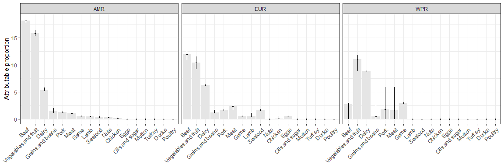<!-- -->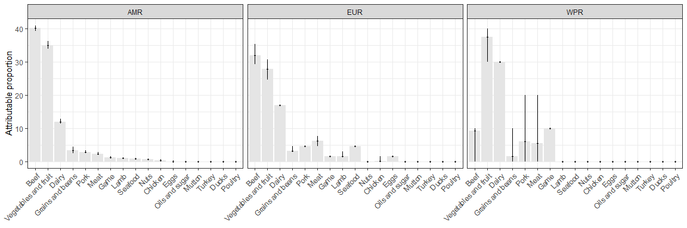<!-- -->

    ## 
    ## 
    ##                         mean   2.5%   97.5%   mean   2.5%   97.5%   mean   2.5%   97.5%
    ## ---------------------  -----  -----  ------  -----  -----  ------  -----  -----  ------
    ## Eggs                     0.0    0.0     0.1    0.6    0.6     0.6    0.0    0.0     0.0
    ## Dairy                    5.4    5.1     5.8    6.3    6.3     6.3    8.8    8.8     8.8
    ## Meat                     1.0    1.0     1.3    2.3    1.7     2.9    1.6    0.0     5.9
    ## Poultry                  0.0    0.0     0.0    0.0    0.0     0.0    0.0    0.0     0.0
    ## Chicken                  0.2    0.1     0.3    0.1    0.0     0.6    0.0    0.0     0.0
    ## Ducks                    0.0    0.0     0.0    0.0    0.0     0.0    0.0    0.0     0.0
    ## Turkey                   0.0    0.0     0.0    0.0    0.0     0.0    0.0    0.0     0.0
    ## Beef                    18.2   17.8    18.5   12.0   10.9    13.2    2.7    0.0     2.9
    ## Pork                     1.3    1.1     1.6    1.7    1.7     1.7    1.8    0.0     5.9
    ## Lamb                     0.5    0.4     0.6    0.6    0.6     1.1    0.0    0.0     0.0
    ## Mutton                   0.0    0.0     0.0    0.0    0.0     0.0    0.0    0.0     0.0
    ## Game                     0.6    0.6     0.7    0.6    0.6     0.6    2.9    2.9     2.9
    ## Vegetables and fruit    15.8   15.3    16.3   10.4    9.2    11.5   11.0    8.8    11.8
    ## Grains and beans         1.5    1.1     2.0    1.2    1.1     1.7    0.5    0.0     2.9
    ## Seafood                  0.4    0.4     0.4    1.7    1.7     1.7    0.0    0.0     0.0
    ## Nuts                     0.3    0.3     0.3    0.0    0.0     0.0    0.0    0.0     0.0
    ## Oils and sugar           0.0    0.0     0.0    0.0    0.0     0.0    0.0    0.0     0.0
    ## Unknown                 54.8   54.8    54.8   62.6   62.6    62.6   70.6   70.6    70.6
    ## 
    ## 
    ##                         mean   2.5%   97.5%   mean   2.5%   97.5%   mean   2.5%   97.5%
    ## ---------------------  -----  -----  ------  -----  -----  ------  -----  -----  ------
    ## Eggs                     0.0    0.0     0.3    1.5    1.5     1.5    0.0      0       0
    ## Dairy                   12.0   11.3    12.9   16.9   16.9    16.9   30.0     30      30
    ## Meat                     2.3    2.2     2.8    6.1    4.6     7.7    5.6      0      20
    ## Poultry                  0.0    0.0     0.0    0.0    0.0     0.0    0.0      0       0
    ## Chicken                  0.3    0.3     0.6    0.1    0.0     1.5    0.0      0       0
    ## Ducks                    0.0    0.0     0.0    0.0    0.0     0.0    0.0      0       0
    ## Turkey                   0.0    0.0     0.0    0.0    0.0     0.0    0.0      0       0
    ## Beef                    40.2   39.3    40.9   32.0   29.2    35.4    9.2      0      10
    ## Pork                     2.9    2.5     3.5    4.6    4.6     4.6    6.0      0      20
    ## Lamb                     1.0    0.9     1.3    1.6    1.5     3.1    0.0      0       0
    ## Mutton                   0.0    0.0     0.0    0.0    0.0     0.0    0.0      0       0
    ## Game                     1.3    1.3     1.6    1.5    1.5     1.5   10.0     10      10
    ## Vegetables and fruit    35.0   34.0    36.2   27.8   24.6    30.8   37.5     30      40
    ## Grains and beans         3.3    2.5     4.4    3.1    3.1     4.6    1.7      0      10
    ## Seafood                  0.9    0.9     0.9    4.6    4.6     4.6    0.0      0       0
    ## Nuts                     0.6    0.6     0.6    0.0    0.0     0.0    0.0      0       0
    ## Oils and sugar           0.0    0.0     0.0    0.0    0.0     0.0    0.0      0       0

# R session info

``` r
sessionInfo()
```

    ## R version 3.5.1 (2018-07-02)
    ## Platform: x86_64-w64-mingw32/x64 (64-bit)
    ## Running under: Windows 7 x64 (build 7601) Service Pack 1
    ## 
    ## Matrix products: default
    ## 
    ## locale:
    ## [1] LC_COLLATE=Dutch_Belgium.1252  LC_CTYPE=Dutch_Belgium.1252   
    ## [3] LC_MONETARY=Dutch_Belgium.1252 LC_NUMERIC=C                  
    ## [5] LC_TIME=Dutch_Belgium.1252    
    ## 
    ## attached base packages:
    ## [1] stats     graphics  grDevices utils     datasets  methods   base     
    ## 
    ## other attached packages:
    ## [1] knitr_1.20    ggplot2_3.0.0 bd_0.0.12    
    ## 
    ## loaded via a namespace (and not attached):
    ##  [1] Rcpp_0.12.18     highr_0.7        cellranger_1.1.0 compiler_3.5.1  
    ##  [5] pillar_1.3.0     plyr_1.8.4       bindr_0.1.1      tools_3.5.1     
    ##  [9] mc2d_0.1-18      digest_0.6.15    evaluate_0.11    tibble_1.4.2    
    ## [13] gtable_0.2.0     pkgconfig_2.0.1  rlang_0.2.1      yaml_2.2.0      
    ## [17] mvtnorm_1.0-8    bindrcpp_0.2.2   withr_2.1.2      stringr_1.3.1   
    ## [21] dplyr_0.7.6      rprojroot_1.3-2  grid_3.5.1       tidyselect_0.2.4
    ## [25] glue_1.3.0       R6_2.2.2         readxl_1.1.0     foreign_0.8-70  
    ## [29] rmarkdown_1.10   reshape2_1.4.3   purrr_0.2.5      magrittr_1.5    
    ## [33] backports_1.1.2  scales_1.0.0     htmltools_0.3.6  assertthat_0.2.0
    ## [37] colorspace_1.3-2 labeling_0.3     stringi_1.1.7    lazyeval_0.2.1  
    ## [41] munsell_0.5.0    crayon_1.3.4

``` r
#rmarkdown::render("stec-outbreaks-multinom3-subgroups.R")
```
