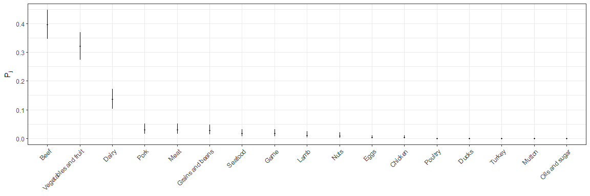
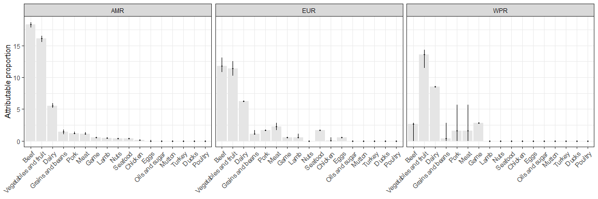
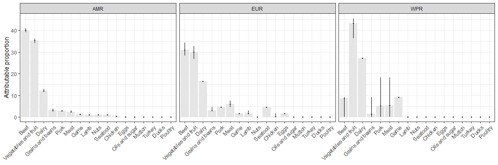

STEC outbreak model
================
Bdevleesschauwer
Mon Oct 15 10:31:20 2018

# Settings

``` r
## required packages
library(bd)
library(ggplot2)
library(knitr)


## simulations
n <- 1e4
set.seed(264)
```

# Data

``` r
## import data
dta <-
  readxl("All data FINAL_oCTOBER 2018_2.xlsx", "FINAL data WITHOUT Water")
str(dta)
```

    ## 'data.frame':    957 obs. of  51 variables:
    ##  $ id                 : chr  "1" "2" "3" "4" ...
    ##  $ Year               : chr  "2003" "2011" "2014" "1982" ...
    ##  $ Country            : chr  "Argentina" "Argentina" "Argentina" "Canada" ...
    ##  $ WHO_Region         : chr  "AMRO" "AMRO" "AMRO" "AMRO" ...
    ##  $ fboStrengthStrong  : chr  NA NA NA NA ...
    ##  $ Agent              : chr  "Verotoxigenic E. coli (VTEC)" "Verotoxigenic E. coli (VTEC)" "Verotoxigenic E. coli (VTEC)" "STEC" ...
    ##  $ Serotype           : chr  NA NA NA "O157:H7" ...
    ##  $ Virulence_factors  : chr  NA NA NA NA ...
    ##  $ fboCode            : chr  NA NA NA NA ...
    ##  $ fboOtherAgents     : chr  NA NA NA NA ...
    ##  $ Outb_Type          : chr  NA NA NA NA ...
    ##  $ Vehicle            : chr  "Homemade hamburger" "Ground beef" "Ground beef" "hamburger" ...
    ##  $ VehicleInfo        : chr  "Homemade hamburger" "Ground beef" "Ground beef" NA ...
    ##  $ Evidence           : chr  "Epidemiologic and laboratory confirmation" "Epidemiologic and laboratory confirmation" "Epidemiologic and laboratory confirmation" "Epidemiological" ...
    ##  $ Setting            : chr  NA NA NA "Old age home" ...
    ##  $ PlaceOrigin        : chr  NA NA NA NA ...
    ##  $ VehicleOrigin      : chr  NA NA NA NA ...
    ##  $ Risk_oFactor       : chr  NA NA NA NA ...
    ##  $ Num_Outbreaks      : num  NA NA NA NA NA NA NA NA NA NA ...
    ##  $ numHumanCases_str  : chr  NA NA NA "353" ...
    ##  $ Num_Cases          : num  1 1 1 353 2 79 109 13 6 16 ...
    ##  $ numHospitalised_str: chr  "1" "1" "1" "4" ...
    ##  $ Num_Hospitalised   : chr  "1" "1" "1" "4" ...
    ##  $ HUS                : chr  "1" "1" "1" NA ...
    ##  $ numDeaths_str      : chr  NA NA NA "1" ...
    ##  $ Num_Deaths         : chr  NA NA NA "1" ...
    ##  $ Comments           : chr  NA NA NA NA ...
    ##  $ footnote           : chr  NA NA NA NA ...
    ##  $ Source             : chr  "Homemade hamburger" "Ground beef" "Ground beef" NA ...
    ##  $ Food               : chr  "Hamburger(ground beef*)" "Ground beef" "Ground beef" "hamburger" ...
    ##  $ Total              : num  NA NA NA NA NA NA NA NA NA NA ...
    ##  $ Unknown_NA         : num  NA NA NA NA NA NA NA NA NA NA ...
    ##  $ Complex_Simple     : chr  "S" "S" "S" "S" ...
    ##  $ Eggs               : num  0 0 0 0 0 0 0 0 0 0 ...
    ##  $ Dairy              : num  0 0 0 0 1 0 0 1 0 1 ...
    ##  $ Meat               : num  0 0 0 0 0 0 0 0 0 0 ...
    ##  $ Poultry            : num  0 0 0 0 0 0 0 0 0 0 ...
    ##  $ Chicken            : num  0 0 0 0 0 0 0 0 0 0 ...
    ##  $ Ducks              : num  0 0 0 0 0 0 0 0 0 0 ...
    ##  $ Turkey             : num  0 0 0 0 0 0 0 0 0 0 ...
    ##  $ Beef               : num  1 1 1 1 0 0 0 0 0 0 ...
    ##  $ Pork               : num  0 0 0 0 0 1 0 0 1 0 ...
    ##  $ Lamb               : num  0 0 0 0 0 0 0 0 0 0 ...
    ##  $ Mutton             : num  0 0 0 0 0 0 0 0 0 0 ...
    ##  $ Game               : num  0 0 0 0 0 0 0 0 0 0 ...
    ##  $ Vegetables.fruit   : num  0 0 0 0 0 0 1 0 0 0 ...
    ##  $ GrainsBeans        : num  0 0 0 0 0 0 0 0 0 0 ...
    ##  $ Seafood            : num  0 0 0 0 0 0 0 0 0 0 ...
    ##  $ nuts               : num  0 0 0 0 0 0 0 0 0 0 ...
    ##  $ Oils_sugar         : num  0 0 0 0 0 0 0 0 0 0 ...
    ##  $ check              : num  1 1 1 1 1 1 1 1 1 1 ...

``` r
## change food names
names(dta)[names(dta) == "Vegetables.fruit"] <-
  "Vegetables and fruit"
names(dta)[names(dta) == "GrainsBeans"] <-
  "Grains and beans"
names(dta)[names(dta) == "Oils_sugar"] <-
  "Oils and sugar"
names(dta)[names(dta) == "nuts"] <-
  "Nuts"

## add indicator combining region-type
dta$Region_Type <- paste(dta$WHO_Region, dta$Complex_Simple)

## descriptions
table(dta$WHO_Region)
```

    ## 
    ## AMRO EURO WPRO 
    ##  746  176   35

``` r
table(dta$Complex_Simple)
```

    ## 
    ##   A   C   S 
    ## 539  57 361

``` r
table(dta$WHO_Region, dta$Complex_Simple)
```

    ##       
    ##          A   C   S
    ##   AMRO 406  45 295
    ##   EURO 109   8  59
    ##   WPRO  24   4   7

``` r
## number of implied foods per type
table(rowSums(dta[dta$Complex_Simple == "S", 34:50]))  # all =1 ?
```

    ## 
    ##   1 
    ## 361

``` r
table(rowSums(dta[dta$Complex_Simple == "C", 34:50]))  # all >1 ?
```

    ## 
    ##  2  3  4 
    ## 43 12  2

``` r
table(rowSums(dta[dta$Complex_Simple == "A", 34:50]))  # all =0 ?
```

    ## 
    ##   0 
    ## 539

``` r
## extract ALL outbreak data
F <- dta[, 34:50]; str(F)
```

    ## 'data.frame':    957 obs. of  17 variables:
    ##  $ Eggs                : num  0 0 0 0 0 0 0 0 0 0 ...
    ##  $ Dairy               : num  0 0 0 0 1 0 0 1 0 1 ...
    ##  $ Meat                : num  0 0 0 0 0 0 0 0 0 0 ...
    ##  $ Poultry             : num  0 0 0 0 0 0 0 0 0 0 ...
    ##  $ Chicken             : num  0 0 0 0 0 0 0 0 0 0 ...
    ##  $ Ducks               : num  0 0 0 0 0 0 0 0 0 0 ...
    ##  $ Turkey              : num  0 0 0 0 0 0 0 0 0 0 ...
    ##  $ Beef                : num  1 1 1 1 0 0 0 0 0 0 ...
    ##  $ Pork                : num  0 0 0 0 0 1 0 0 1 0 ...
    ##  $ Lamb                : num  0 0 0 0 0 0 0 0 0 0 ...
    ##  $ Mutton              : num  0 0 0 0 0 0 0 0 0 0 ...
    ##  $ Game                : num  0 0 0 0 0 0 0 0 0 0 ...
    ##  $ Vegetables and fruit: num  0 0 0 0 0 0 1 0 0 0 ...
    ##  $ Grains and beans    : num  0 0 0 0 0 0 0 0 0 0 ...
    ##  $ Seafood             : num  0 0 0 0 0 0 0 0 0 0 ...
    ##  $ Nuts                : num  0 0 0 0 0 0 0 0 0 0 ...
    ##  $ Oils and sugar      : num  0 0 0 0 0 0 0 0 0 0 ...

``` r
sort(colSums(F), decreasing = TRUE)
```

    ##                 Beef Vegetables and fruit                Dairy 
    ##                  164                  154                   61 
    ##     Grains and beans                 Meat                 Pork 
    ##                   28                   19                   17 
    ##              Chicken                 Eggs                 Lamb 
    ##                   11                   10                    7 
    ##                 Game              Seafood                 Nuts 
    ##                    7                    6                    3 
    ##               Turkey       Oils and sugar              Poultry 
    ##                    2                    2                    0 
    ##                Ducks               Mutton 
    ##                    0                    0

``` r
table(rowSums(F))
```

    ## 
    ##   0   1   2   3   4 
    ## 539 361  43  12   2

``` r
## extract SIMPLE outbreak data
S <- dta[dta$Complex_Simple == "S", 34:50]; str(S)
```

    ## 'data.frame':    361 obs. of  17 variables:
    ##  $ Eggs                : num  0 0 0 0 0 0 0 0 0 0 ...
    ##  $ Dairy               : num  0 0 0 0 1 0 0 1 0 1 ...
    ##  $ Meat                : num  0 0 0 0 0 0 0 0 0 0 ...
    ##  $ Poultry             : num  0 0 0 0 0 0 0 0 0 0 ...
    ##  $ Chicken             : num  0 0 0 0 0 0 0 0 0 0 ...
    ##  $ Ducks               : num  0 0 0 0 0 0 0 0 0 0 ...
    ##  $ Turkey              : num  0 0 0 0 0 0 0 0 0 0 ...
    ##  $ Beef                : num  1 1 1 1 0 0 0 0 0 0 ...
    ##  $ Pork                : num  0 0 0 0 0 1 0 0 1 0 ...
    ##  $ Lamb                : num  0 0 0 0 0 0 0 0 0 0 ...
    ##  $ Mutton              : num  0 0 0 0 0 0 0 0 0 0 ...
    ##  $ Game                : num  0 0 0 0 0 0 0 0 0 0 ...
    ##  $ Vegetables and fruit: num  0 0 0 0 0 0 1 0 0 0 ...
    ##  $ Grains and beans    : num  0 0 0 0 0 0 0 0 0 0 ...
    ##  $ Seafood             : num  0 0 0 0 0 0 0 0 0 0 ...
    ##  $ Nuts                : num  0 0 0 0 0 0 0 0 0 0 ...
    ##  $ Oils and sugar      : num  0 0 0 0 0 0 0 0 0 0 ...

``` r
sort(colSums(S), decreasing = TRUE)
```

    ##                 Beef Vegetables and fruit                Dairy 
    ##                  143                  116                   49 
    ##                 Meat                 Pork     Grains and beans 
    ##                   11                   11                   10 
    ##                 Game              Seafood                 Lamb 
    ##                    6                    6                    4 
    ##                 Nuts                 Eggs              Chicken 
    ##                    3                    1                    1 
    ##              Poultry                Ducks               Turkey 
    ##                    0                    0                    0 
    ##               Mutton       Oils and sugar 
    ##                    0                    0

``` r
table(rowSums(S))  # all == 1 ?
```

    ## 
    ##   1 
    ## 361

# Model

``` r
## prior distribution / Dirichlet

sourceS <- colSums(S)
PriorS <- mc2d::rdirichlet(n, sourceS)
colnames(PriorS) <- names(sourceS)

PriorS_out <- t(apply(PriorS, 2, mean_ci))[rev(order(colMeans(PriorS))), ]
kable(
  PriorS_out,
  digits = 3)
```

|                      |  mean |  2.5% | 97.5% |
| -------------------- | ----: | ----: | ----: |
| Beef                 | 0.396 | 0.346 | 0.447 |
| Vegetables and fruit | 0.321 | 0.274 | 0.369 |
| Dairy                | 0.136 | 0.103 | 0.173 |
| Pork                 | 0.031 | 0.015 | 0.051 |
| Meat                 | 0.030 | 0.015 | 0.050 |
| Grains and beans     | 0.028 | 0.013 | 0.047 |
| Seafood              | 0.017 | 0.006 | 0.032 |
| Game                 | 0.017 | 0.006 | 0.032 |
| Lamb                 | 0.011 | 0.003 | 0.024 |
| Nuts                 | 0.008 | 0.002 | 0.020 |
| Eggs                 | 0.003 | 0.000 | 0.010 |
| Chicken              | 0.003 | 0.000 | 0.010 |
| Oils and sugar       | 0.000 | 0.000 | 0.000 |
| Mutton               | 0.000 | 0.000 | 0.000 |
| Turkey               | 0.000 | 0.000 | 0.000 |
| Ducks                | 0.000 | 0.000 | 0.000 |
| Poultry              | 0.000 | 0.000 | 0.000 |

``` r
PriorS_df <- as.data.frame(PriorS_out)
colnames(PriorS_df) <- c("mean", "lwr", "upr")
PriorS_df$Food <- 
  factor(rownames(PriorS_df),
         rownames(PriorS_df)[rev(order(PriorS_df$mean))])
```

``` r
ggplot(PriorS_df, aes(x = Food, y = mean)) +
  geom_pointrange(aes(ymin = lwr, ymax = upr), size = 0.1) +
  theme_bw() +
  theme(axis.text.x = element_text(angle = 45, hjust = 1)) +
  scale_y_continuous(expression(P[j])) +
  scale_x_discrete(NULL)
```

<!-- -->

``` r
## simple foods
sourceSAMRO <- colSums(F[dta$Region_Type == "AMRO S", ])
sourceSEURO <- colSums(F[dta$Region_Type == "EURO S", ])
sourceSWPRO <- colSums(F[dta$Region_Type == "WPRO S", ])

kable(cbind(sourceSAMRO, sourceSEURO, sourceSWPRO)[rev(order(sourceSAMRO)), ])
```

|                      | sourceSAMRO | sourceSEURO | sourceSWPRO |
| -------------------- | ----------: | ----------: | ----------: |
| Beef                 |         125 |          18 |           0 |
| Vegetables and fruit |          97 |          16 |           3 |
| Dairy                |          35 |          11 |           3 |
| Grains and beans     |           8 |           2 |           0 |
| Pork                 |           8 |           3 |           0 |
| Meat                 |           8 |           3 |           0 |
| Game                 |           4 |           1 |           1 |
| Nuts                 |           3 |           0 |           0 |
| Seafood              |           3 |           3 |           0 |
| Lamb                 |           3 |           1 |           0 |
| Chicken              |           1 |           0 |           0 |
| Oils and sugar       |           0 |           0 |           0 |
| Mutton               |           0 |           0 |           0 |
| Turkey               |           0 |           0 |           0 |
| Ducks                |           0 |           0 |           0 |
| Poultry              |           0 |           0 |           0 |
| Eggs                 |           0 |           1 |           0 |

``` r
## redistribute complex foods
aAMRO <- array(dim = c(ncol(F), sum(dta$Region_Type == "AMRO C"), n))
aEURO <- array(dim = c(ncol(F), sum(dta$Region_Type == "EURO C"), n))
aWPRO <- array(dim = c(ncol(F), sum(dta$Region_Type == "WPRO C"), n))

for (i in seq(ncol(F))) {  # fill array per source
  aAMRO[i, ,] <- F[dta$Region_Type == "AMRO C", i] %o% PriorS[, i]
  aEURO[i, ,] <- F[dta$Region_Type == "EURO C", i] %o% PriorS[, i]
  aWPRO[i, ,] <- F[dta$Region_Type == "WPRO C", i] %o% PriorS[, i]
}


## per iteration, simulate single food source
simulate <-
function(x) {
  y <- apply(x, 3, function(z) apply(z, 2, rmultinom, n = 1, size = 1))
  y <- array(y, dim = dim(x))
}

nm <- 20  # number of multinomial samples

cAMRO <- replicate(nm, simulate(aAMRO)); str(cAMRO)
```

    ##  int [1:17, 1:45, 1:10000, 1:20] 0 0 0 0 0 0 0 1 0 0 ...

``` r
cEURO <- replicate(nm, simulate(aEURO)); str(cEURO)
```

    ##  int [1:17, 1:8, 1:10000, 1:20] 0 0 1 0 0 0 0 0 0 0 ...

``` r
cWPRO <- replicate(nm, simulate(aWPRO)); str(cWPRO)
```

    ##  int [1:17, 1:4, 1:10000, 1:20] 0 0 0 0 0 0 0 0 0 0 ...

``` r
cAMRO <- array(cAMRO, dim = dim(aAMRO) * c(1, 1, nm))
cEURO <- array(cEURO, dim = dim(aEURO) * c(1, 1, nm))
cWPRO <- array(cWPRO, dim = dim(aWPRO) * c(1, 1, nm))


## sum of complex food outbreaks per source
sourceCAMRO <- apply(cAMRO, c(1,3), sum); str(sourceCAMRO)
```

    ##  int [1:17, 1:200000] 0 7 0 0 0 0 0 14 2 1 ...

``` r
sourceCEURO <- apply(cEURO, c(1,3), sum); str(sourceCEURO)
```

    ##  int [1:17, 1:200000] 0 0 1 0 0 0 0 3 0 0 ...

``` r
sourceCWPRO <- apply(cWPRO, c(1,3), sum); str(sourceCWPRO)
```

    ##  int [1:17, 1:200000] 0 0 0 0 0 0 0 1 1 0 ...

``` r
rownames(sourceCAMRO) <-
  rownames(sourceCEURO) <-
  rownames(sourceCWPRO) <-
  colnames(PriorS)

sourceCAMRO_out <- t(apply(sourceCAMRO, 1, mean_ci))
sourceCEURO_out <- t(apply(sourceCEURO, 1, mean_ci))
sourceCWPRO_out <- t(apply(sourceCWPRO, 1, mean_ci))

kable(sourceCAMRO_out[rev(order(sourceCAMRO_out[, 1])), ], digits = 1)
```

|                      | mean | 2.5% | 97.5% |
| -------------------- | ---: | ---: | ----: |
| Vegetables and fruit | 22.9 |   19 |    26 |
| Beef                 | 11.4 |    8 |    14 |
| Dairy                |  6.1 |    4 |     9 |
| Grains and beans     |  2.6 |    0 |     5 |
| Pork                 |  1.2 |    0 |     3 |
| Lamb                 |  0.3 |    0 |     1 |
| Meat                 |  0.3 |    0 |     2 |
| Eggs                 |  0.1 |    0 |     1 |
| Chicken              |  0.1 |    0 |     1 |
| Game                 |  0.0 |    0 |     1 |
| Oils and sugar       |  0.0 |    0 |     0 |
| Nuts                 |  0.0 |    0 |     0 |
| Seafood              |  0.0 |    0 |     0 |
| Mutton               |  0.0 |    0 |     0 |
| Turkey               |  0.0 |    0 |     0 |
| Ducks                |  0.0 |    0 |     0 |
| Poultry              |  0.0 |    0 |     0 |

``` r
kable(sourceCEURO_out[rev(order(sourceCEURO_out[, 1])), ], digits = 1)
```

|                      | mean | 2.5% | 97.5% |
| -------------------- | ---: | ---: | ----: |
| Vegetables and fruit |  4.1 |    2 |     6 |
| Beef                 |  2.7 |    1 |     5 |
| Meat                 |  1.0 |    0 |     2 |
| Chicken              |  0.1 |    0 |     1 |
| Grains and beans     |  0.0 |    0 |     1 |
| Lamb                 |  0.0 |    0 |     1 |
| Oils and sugar       |  0.0 |    0 |     0 |
| Nuts                 |  0.0 |    0 |     0 |
| Seafood              |  0.0 |    0 |     0 |
| Game                 |  0.0 |    0 |     0 |
| Mutton               |  0.0 |    0 |     0 |
| Pork                 |  0.0 |    0 |     0 |
| Turkey               |  0.0 |    0 |     0 |
| Ducks                |  0.0 |    0 |     0 |
| Poultry              |  0.0 |    0 |     0 |
| Dairy                |  0.0 |    0 |     0 |
| Eggs                 |  0.0 |    0 |     0 |

``` r
kable(sourceCWPRO_out[rev(order(sourceCWPRO_out[, 1])), ], digits = 1)
```

|                      | mean | 2.5% | 97.5% |
| -------------------- | ---: | ---: | ----: |
| Vegetables and fruit |  1.8 |    1 |     2 |
| Beef                 |  0.9 |    0 |     1 |
| Meat                 |  0.6 |    0 |     2 |
| Pork                 |  0.6 |    0 |     2 |
| Grains and beans     |  0.2 |    0 |     1 |
| Oils and sugar       |  0.0 |    0 |     0 |
| Nuts                 |  0.0 |    0 |     0 |
| Seafood              |  0.0 |    0 |     0 |
| Game                 |  0.0 |    0 |     0 |
| Mutton               |  0.0 |    0 |     0 |
| Lamb                 |  0.0 |    0 |     0 |
| Turkey               |  0.0 |    0 |     0 |
| Ducks                |  0.0 |    0 |     0 |
| Chicken              |  0.0 |    0 |     0 |
| Poultry              |  0.0 |    0 |     0 |
| Dairy                |  0.0 |    0 |     0 |
| Eggs                 |  0.0 |    0 |     0 |

``` r
## total outbreaks
TotalAMRO <- sourceSAMRO + sourceCAMRO
TotalEURO <- sourceSEURO + sourceCEURO
TotalWPRO <- sourceSWPRO + sourceCWPRO

TotalAMRO_out <- t(apply(TotalAMRO, 1, mean_ci))
TotalEURO_out <- t(apply(TotalEURO, 1, mean_ci))
TotalWPRO_out <- t(apply(TotalWPRO, 1, mean_ci))

kable(TotalAMRO_out[rev(order(TotalAMRO_out[, 1])), ], digits = 1)
```

|                      |  mean | 2.5% | 97.5% |
| -------------------- | ----: | ---: | ----: |
| Beef                 | 136.4 |  133 |   139 |
| Vegetables and fruit | 119.9 |  116 |   123 |
| Dairy                |  41.1 |   39 |    44 |
| Grains and beans     |  10.6 |    8 |    13 |
| Pork                 |   9.2 |    8 |    11 |
| Meat                 |   8.3 |    8 |    10 |
| Game                 |   4.0 |    4 |     5 |
| Lamb                 |   3.3 |    3 |     4 |
| Nuts                 |   3.0 |    3 |     3 |
| Seafood              |   3.0 |    3 |     3 |
| Chicken              |   1.1 |    1 |     2 |
| Eggs                 |   0.1 |    0 |     1 |
| Oils and sugar       |   0.0 |    0 |     0 |
| Mutton               |   0.0 |    0 |     0 |
| Turkey               |   0.0 |    0 |     0 |
| Ducks                |   0.0 |    0 |     0 |
| Poultry              |   0.0 |    0 |     0 |

``` r
kable(TotalEURO_out[rev(order(TotalEURO_out[, 1])), ], digits = 1)
```

|                      | mean | 2.5% | 97.5% |
| -------------------- | ---: | ---: | ----: |
| Beef                 | 20.7 |   19 |    23 |
| Vegetables and fruit | 20.1 |   18 |    22 |
| Dairy                | 11.0 |   11 |    11 |
| Meat                 |  4.0 |    3 |     5 |
| Seafood              |  3.0 |    3 |     3 |
| Pork                 |  3.0 |    3 |     3 |
| Grains and beans     |  2.0 |    2 |     3 |
| Lamb                 |  1.0 |    1 |     2 |
| Game                 |  1.0 |    1 |     1 |
| Eggs                 |  1.0 |    1 |     1 |
| Chicken              |  0.1 |    0 |     1 |
| Oils and sugar       |  0.0 |    0 |     0 |
| Nuts                 |  0.0 |    0 |     0 |
| Mutton               |  0.0 |    0 |     0 |
| Turkey               |  0.0 |    0 |     0 |
| Ducks                |  0.0 |    0 |     0 |
| Poultry              |  0.0 |    0 |     0 |

``` r
kable(TotalWPRO_out[rev(order(TotalWPRO_out[, 1])), ], digits = 1)
```

|                      | mean | 2.5% | 97.5% |
| -------------------- | ---: | ---: | ----: |
| Vegetables and fruit |  4.8 |    4 |     5 |
| Dairy                |  3.0 |    3 |     3 |
| Game                 |  1.0 |    1 |     1 |
| Beef                 |  0.9 |    0 |     1 |
| Meat                 |  0.6 |    0 |     2 |
| Pork                 |  0.6 |    0 |     2 |
| Grains and beans     |  0.2 |    0 |     1 |
| Oils and sugar       |  0.0 |    0 |     0 |
| Nuts                 |  0.0 |    0 |     0 |
| Seafood              |  0.0 |    0 |     0 |
| Mutton               |  0.0 |    0 |     0 |
| Lamb                 |  0.0 |    0 |     0 |
| Turkey               |  0.0 |    0 |     0 |
| Ducks                |  0.0 |    0 |     0 |
| Chicken              |  0.0 |    0 |     0 |
| Poultry              |  0.0 |    0 |     0 |
| Eggs                 |  0.0 |    0 |     0 |

``` r
## total outbreak attributions
AttribAMRO <- 100 * TotalAMRO / sum(dta$WHO_Region == "AMRO")
AttribEURO <- 100 * TotalEURO / sum(dta$WHO_Region == "EURO")
AttribWPRO <- 100 * TotalWPRO / sum(dta$WHO_Region == "WPRO")

AttribAMRO_out <- t(apply(AttribAMRO, 1, mean_ci))
AttribEURO_out <- t(apply(AttribEURO, 1, mean_ci))
AttribWPRO_out <- t(apply(AttribWPRO, 1, mean_ci))

## add unknown
AttribAMRO_unk <- rbind(AttribAMRO, Unknown = 100 - colSums(AttribAMRO))
AttribEURO_unk <- rbind(AttribEURO, Unknown = 100 - colSums(AttribEURO))
AttribWPRO_unk <- rbind(AttribWPRO, Unknown = 100 - colSums(AttribWPRO))

AttribAMRO_unk_out <- t(apply(AttribAMRO_unk, 1, mean_ci))
AttribEURO_unk_out <- t(apply(AttribEURO_unk, 1, mean_ci))
AttribWPRO_unk_out <- t(apply(AttribWPRO_unk, 1, mean_ci))

kable(AttribAMRO_unk_out[rev(order(AttribAMRO_unk_out[, 1])), ], digits = 1)
```

|                      | mean | 2.5% | 97.5% |
| -------------------- | ---: | ---: | ----: |
| Unknown              | 54.4 | 54.4 |  54.4 |
| Beef                 | 18.3 | 17.8 |  18.6 |
| Vegetables and fruit | 16.1 | 15.5 |  16.5 |
| Dairy                |  5.5 |  5.2 |   5.9 |
| Grains and beans     |  1.4 |  1.1 |   1.7 |
| Pork                 |  1.2 |  1.1 |   1.5 |
| Meat                 |  1.1 |  1.1 |   1.3 |
| Game                 |  0.5 |  0.5 |   0.7 |
| Lamb                 |  0.4 |  0.4 |   0.5 |
| Nuts                 |  0.4 |  0.4 |   0.4 |
| Seafood              |  0.4 |  0.4 |   0.4 |
| Chicken              |  0.1 |  0.1 |   0.3 |
| Eggs                 |  0.0 |  0.0 |   0.1 |
| Oils and sugar       |  0.0 |  0.0 |   0.0 |
| Mutton               |  0.0 |  0.0 |   0.0 |
| Turkey               |  0.0 |  0.0 |   0.0 |
| Ducks                |  0.0 |  0.0 |   0.0 |
| Poultry              |  0.0 |  0.0 |   0.0 |

``` r
kable(AttribEURO_unk_out[rev(order(AttribEURO_unk_out[, 1])), ], digits = 1)
```

|                      | mean | 2.5% | 97.5% |
| -------------------- | ---: | ---: | ----: |
| Unknown              | 61.9 | 61.9 |  61.9 |
| Beef                 | 11.8 | 10.8 |  13.1 |
| Vegetables and fruit | 11.4 | 10.2 |  12.5 |
| Dairy                |  6.2 |  6.2 |   6.2 |
| Meat                 |  2.3 |  1.7 |   2.8 |
| Seafood              |  1.7 |  1.7 |   1.7 |
| Pork                 |  1.7 |  1.7 |   1.7 |
| Grains and beans     |  1.2 |  1.1 |   1.7 |
| Lamb                 |  0.6 |  0.6 |   1.1 |
| Game                 |  0.6 |  0.6 |   0.6 |
| Eggs                 |  0.6 |  0.6 |   0.6 |
| Chicken              |  0.0 |  0.0 |   0.6 |
| Oils and sugar       |  0.0 |  0.0 |   0.0 |
| Nuts                 |  0.0 |  0.0 |   0.0 |
| Mutton               |  0.0 |  0.0 |   0.0 |
| Turkey               |  0.0 |  0.0 |   0.0 |
| Ducks                |  0.0 |  0.0 |   0.0 |
| Poultry              |  0.0 |  0.0 |   0.0 |

``` r
kable(AttribWPRO_unk_out[rev(order(AttribWPRO_unk_out[, 1])), ], digits = 1)
```

|                      | mean | 2.5% | 97.5% |
| -------------------- | ---: | ---: | ----: |
| Unknown              | 68.6 | 68.6 |  68.6 |
| Vegetables and fruit | 13.6 | 11.4 |  14.3 |
| Dairy                |  8.6 |  8.6 |   8.6 |
| Game                 |  2.9 |  2.9 |   2.9 |
| Beef                 |  2.7 |  0.0 |   2.9 |
| Meat                 |  1.7 |  0.0 |   5.7 |
| Pork                 |  1.6 |  0.0 |   5.7 |
| Grains and beans     |  0.4 |  0.0 |   2.9 |
| Oils and sugar       |  0.0 |  0.0 |   0.0 |
| Nuts                 |  0.0 |  0.0 |   0.0 |
| Seafood              |  0.0 |  0.0 |   0.0 |
| Mutton               |  0.0 |  0.0 |   0.0 |
| Lamb                 |  0.0 |  0.0 |   0.0 |
| Turkey               |  0.0 |  0.0 |   0.0 |
| Ducks                |  0.0 |  0.0 |   0.0 |
| Chicken              |  0.0 |  0.0 |   0.0 |
| Poultry              |  0.0 |  0.0 |   0.0 |
| Eggs                 |  0.0 |  0.0 |   0.0 |

``` r
## normalized
AttribAMRO_norm <- 100 * apply(AttribAMRO/100, 2, prop.table)
AttribEURO_norm <- 100 * apply(AttribEURO/100, 2, prop.table)
AttribWPRO_norm <- 100 * apply(AttribWPRO/100, 2, prop.table)

AttribAMRO_norm_out <- t(apply(AttribAMRO_norm, 1, mean_ci))
AttribEURO_norm_out <- t(apply(AttribEURO_norm, 1, mean_ci))
AttribWPRO_norm_out <- t(apply(AttribWPRO_norm, 1, mean_ci))

kable(AttribAMRO_norm_out[rev(order(AttribAMRO_norm_out[, 1])), ], digits = 1)
```

|                      | mean | 2.5% | 97.5% |
| -------------------- | ---: | ---: | ----: |
| Beef                 | 40.1 | 39.1 |  40.9 |
| Vegetables and fruit | 35.3 | 34.1 |  36.2 |
| Dairy                | 12.1 | 11.5 |  12.9 |
| Grains and beans     |  3.1 |  2.4 |   3.8 |
| Pork                 |  2.7 |  2.4 |   3.2 |
| Meat                 |  2.4 |  2.4 |   2.9 |
| Game                 |  1.2 |  1.2 |   1.5 |
| Lamb                 |  1.0 |  0.9 |   1.2 |
| Nuts                 |  0.9 |  0.9 |   0.9 |
| Seafood              |  0.9 |  0.9 |   0.9 |
| Chicken              |  0.3 |  0.3 |   0.6 |
| Eggs                 |  0.0 |  0.0 |   0.3 |
| Oils and sugar       |  0.0 |  0.0 |   0.0 |
| Mutton               |  0.0 |  0.0 |   0.0 |
| Turkey               |  0.0 |  0.0 |   0.0 |
| Ducks                |  0.0 |  0.0 |   0.0 |
| Poultry              |  0.0 |  0.0 |   0.0 |

``` r
kable(AttribEURO_norm_out[rev(order(AttribEURO_norm_out[, 1])), ], digits = 1)
```

|                      | mean | 2.5% | 97.5% |
| -------------------- | ---: | ---: | ----: |
| Beef                 | 31.0 | 28.4 |  34.3 |
| Vegetables and fruit | 30.0 | 26.9 |  32.8 |
| Dairy                | 16.4 | 16.4 |  16.4 |
| Meat                 |  6.0 |  4.5 |   7.5 |
| Seafood              |  4.5 |  4.5 |   4.5 |
| Pork                 |  4.5 |  4.5 |   4.5 |
| Grains and beans     |  3.0 |  3.0 |   4.5 |
| Lamb                 |  1.5 |  1.5 |   3.0 |
| Game                 |  1.5 |  1.5 |   1.5 |
| Eggs                 |  1.5 |  1.5 |   1.5 |
| Chicken              |  0.1 |  0.0 |   1.5 |
| Oils and sugar       |  0.0 |  0.0 |   0.0 |
| Nuts                 |  0.0 |  0.0 |   0.0 |
| Mutton               |  0.0 |  0.0 |   0.0 |
| Turkey               |  0.0 |  0.0 |   0.0 |
| Ducks                |  0.0 |  0.0 |   0.0 |
| Poultry              |  0.0 |  0.0 |   0.0 |

``` r
kable(AttribWPRO_norm_out[rev(order(AttribWPRO_norm_out[, 1])), ], digits = 1)
```

|                      | mean | 2.5% | 97.5% |
| -------------------- | ---: | ---: | ----: |
| Vegetables and fruit | 43.3 | 36.4 |  45.5 |
| Dairy                | 27.3 | 27.3 |  27.3 |
| Game                 |  9.1 |  9.1 |   9.1 |
| Beef                 |  8.4 |  0.0 |   9.1 |
| Meat                 |  5.3 |  0.0 |  18.2 |
| Pork                 |  5.2 |  0.0 |  18.2 |
| Grains and beans     |  1.4 |  0.0 |   9.1 |
| Oils and sugar       |  0.0 |  0.0 |   0.0 |
| Nuts                 |  0.0 |  0.0 |   0.0 |
| Seafood              |  0.0 |  0.0 |   0.0 |
| Mutton               |  0.0 |  0.0 |   0.0 |
| Lamb                 |  0.0 |  0.0 |   0.0 |
| Turkey               |  0.0 |  0.0 |   0.0 |
| Ducks                |  0.0 |  0.0 |   0.0 |
| Chicken              |  0.0 |  0.0 |   0.0 |
| Poultry              |  0.0 |  0.0 |   0.0 |
| Eggs                 |  0.0 |  0.0 |   0.0 |

``` r
## plot all results / with unknown
df <-
rbind(
  data.frame(Region = "AMRO",
             Food = rownames(AttribAMRO_out),
             AttribAMRO_out),
  data.frame(Region = "EURO",
             Food = rownames(AttribEURO_out),
             AttribEURO_out),
  data.frame(Region = "WPRO",
             Food = rownames(AttribWPRO_out),
             AttribWPRO_out))

foods <- rev(rownames(AttribAMRO_out[order(AttribAMRO_out[, 1]), ]))
df$Food <- factor(df$Food, levels = foods)
df$Region <- gsub("O", "", df$Region)
```

``` r
ggplot(df, aes(x = Food, y = mean)) +
  geom_col(fill = "grey90") +
  geom_pointrange(aes(ymin = X2.5., ymax = X97.5.), size = 0.1) +
  facet_grid(~Region) +
  theme_bw() +
  theme(axis.text.x = element_text(angle = 45, hjust = 1)) +
  scale_y_continuous("Attributable proportion") +
  scale_x_discrete(NULL)
```

<!-- -->

``` r
## plot all results / normalized
df2 <-
rbind(
  data.frame(Region = "AMRO",
             Food = rownames(AttribAMRO_out),
             AttribAMRO_norm_out),
  data.frame(Region = "EURO",
             Food = rownames(AttribEURO_out),
             AttribEURO_norm_out),
  data.frame(Region = "WPRO",
             Food = rownames(AttribWPRO_out),
             AttribWPRO_norm_out))

foods <- rev(rownames(AttribAMRO_out[order(AttribAMRO_out[, 1]), ]))
df2$Food <- factor(df2$Food, levels = foods)
df2$Region <- gsub("O", "", df2$Region)
```

``` r
ggplot(df2, aes(x = Food, y = mean)) +
  geom_col(fill = "grey90") +
  geom_pointrange(aes(ymin = X2.5., ymax = X97.5.), size = 0.1) +
  facet_grid(~Region) +
  theme_bw() +
  theme(axis.text.x = element_text(angle = 45, hjust = 1)) +
  scale_y_continuous("Attributable proportion") +
  scale_x_discrete(NULL)
```

<!-- -->

``` r
## summary table
kable(
  digits = 1,
  cbind(AttribAMRO_unk_out, AttribEURO_unk_out, AttribWPRO_unk_out))
```

|                      | mean | 2.5% | 97.5% | mean | 2.5% | 97.5% | mean | 2.5% | 97.5% |
| -------------------- | ---: | ---: | ----: | ---: | ---: | ----: | ---: | ---: | ----: |
| Eggs                 |  0.0 |  0.0 |   0.1 |  0.6 |  0.6 |   0.6 |  0.0 |  0.0 |   0.0 |
| Dairy                |  5.5 |  5.2 |   5.9 |  6.2 |  6.2 |   6.2 |  8.6 |  8.6 |   8.6 |
| Meat                 |  1.1 |  1.1 |   1.3 |  2.3 |  1.7 |   2.8 |  1.7 |  0.0 |   5.7 |
| Poultry              |  0.0 |  0.0 |   0.0 |  0.0 |  0.0 |   0.0 |  0.0 |  0.0 |   0.0 |
| Chicken              |  0.1 |  0.1 |   0.3 |  0.0 |  0.0 |   0.6 |  0.0 |  0.0 |   0.0 |
| Ducks                |  0.0 |  0.0 |   0.0 |  0.0 |  0.0 |   0.0 |  0.0 |  0.0 |   0.0 |
| Turkey               |  0.0 |  0.0 |   0.0 |  0.0 |  0.0 |   0.0 |  0.0 |  0.0 |   0.0 |
| Beef                 | 18.3 | 17.8 |  18.6 | 11.8 | 10.8 |  13.1 |  2.7 |  0.0 |   2.9 |
| Pork                 |  1.2 |  1.1 |   1.5 |  1.7 |  1.7 |   1.7 |  1.6 |  0.0 |   5.7 |
| Lamb                 |  0.4 |  0.4 |   0.5 |  0.6 |  0.6 |   1.1 |  0.0 |  0.0 |   0.0 |
| Mutton               |  0.0 |  0.0 |   0.0 |  0.0 |  0.0 |   0.0 |  0.0 |  0.0 |   0.0 |
| Game                 |  0.5 |  0.5 |   0.7 |  0.6 |  0.6 |   0.6 |  2.9 |  2.9 |   2.9 |
| Vegetables and fruit | 16.1 | 15.5 |  16.5 | 11.4 | 10.2 |  12.5 | 13.6 | 11.4 |  14.3 |
| Grains and beans     |  1.4 |  1.1 |   1.7 |  1.2 |  1.1 |   1.7 |  0.4 |  0.0 |   2.9 |
| Seafood              |  0.4 |  0.4 |   0.4 |  1.7 |  1.7 |   1.7 |  0.0 |  0.0 |   0.0 |
| Nuts                 |  0.4 |  0.4 |   0.4 |  0.0 |  0.0 |   0.0 |  0.0 |  0.0 |   0.0 |
| Oils and sugar       |  0.0 |  0.0 |   0.0 |  0.0 |  0.0 |   0.0 |  0.0 |  0.0 |   0.0 |
| Unknown              | 54.4 | 54.4 |  54.4 | 61.9 | 61.9 |  61.9 | 68.6 | 68.6 |  68.6 |

# R session info

``` r
sessionInfo()
```

    ## R version 3.5.1 (2018-07-02)
    ## Platform: x86_64-w64-mingw32/x64 (64-bit)
    ## Running under: Windows 7 x64 (build 7601) Service Pack 1
    ## 
    ## Matrix products: default
    ## 
    ## locale:
    ## [1] LC_COLLATE=Dutch_Belgium.1252  LC_CTYPE=Dutch_Belgium.1252   
    ## [3] LC_MONETARY=Dutch_Belgium.1252 LC_NUMERIC=C                  
    ## [5] LC_TIME=Dutch_Belgium.1252    
    ## 
    ## attached base packages:
    ## [1] stats     graphics  grDevices utils     datasets  methods   base     
    ## 
    ## other attached packages:
    ## [1] knitr_1.20    ggplot2_3.0.0 bd_0.0.12    
    ## 
    ## loaded via a namespace (and not attached):
    ##  [1] Rcpp_0.12.18     highr_0.7        cellranger_1.1.0 compiler_3.5.1  
    ##  [5] pillar_1.3.0     plyr_1.8.4       bindr_0.1.1      tools_3.5.1     
    ##  [9] mc2d_0.1-18      digest_0.6.15    evaluate_0.11    tibble_1.4.2    
    ## [13] gtable_0.2.0     pkgconfig_2.0.1  rlang_0.2.1      yaml_2.2.0      
    ## [17] mvtnorm_1.0-8    bindrcpp_0.2.2   withr_2.1.2      stringr_1.3.1   
    ## [21] dplyr_0.7.6      rprojroot_1.3-2  grid_3.5.1       tidyselect_0.2.4
    ## [25] glue_1.3.0       R6_2.2.2         readxl_1.1.0     foreign_0.8-70  
    ## [29] rmarkdown_1.10   reshape2_1.4.3   purrr_0.2.5      magrittr_1.5    
    ## [33] backports_1.1.2  scales_1.0.0     htmltools_0.3.6  assertthat_0.2.0
    ## [37] colorspace_1.3-2 labeling_0.3     stringi_1.1.7    lazyeval_0.2.1  
    ## [41] munsell_0.5.0    crayon_1.3.4

``` r
#rmarkdown::render("stec-outbreaks-multinom3.R")
```
